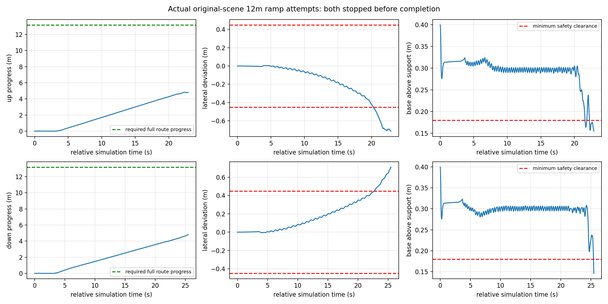
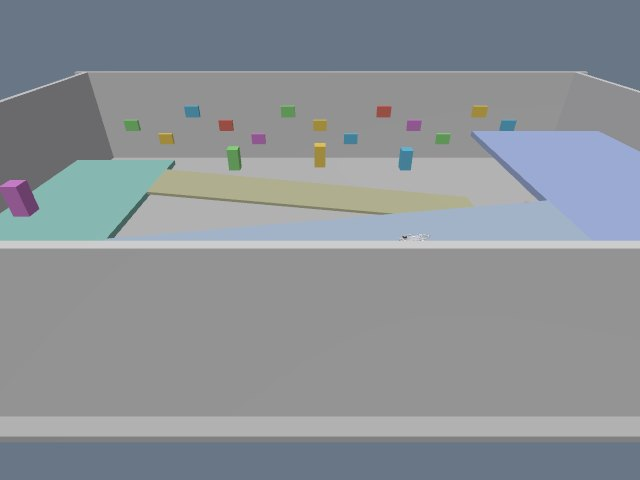
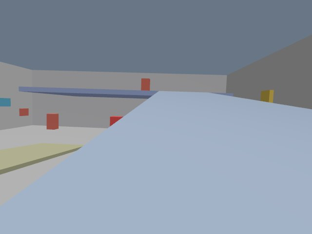
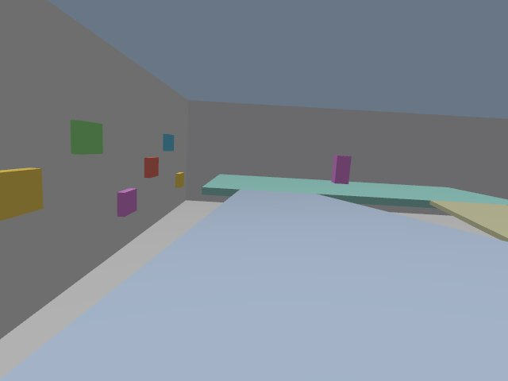

# 完整12米坡道验证（2026-10-04）

原三层场景中的 `ramp_23` 完整上、下行首轮均失败，不能沿用历史约2米局部坡道通过来宣称完整通过。两轮分别实际前进4.820米和4.807米，均未到达另一端平台，因此目标平台过渡和停车尚未完成验证。CPU推理、独占关节执行、实际接触日志和进程自然退出均正常；失败来自本次闭环运动的安全与路线判据。策略与模型/观测适配各自的贡献仍需对照实验，不能仅凭接口通过归因。

本轮是原场景10%连续坡道，**不是楼梯**。水平段为 `x=2..14, y=7`，坡面 `z=2.6−0.1x`，连接第二层1.2米与第三层2.4米平台；机器人、坡道、楼板、碰撞和力矩控制未为本轮增加位置或机身伺服。

## 事前协议与来源

两个schedule与独立[完整坡道协议](../tests/ramp_full_protocol.json)在首轮启动前冻结，协议SHA256为 `1e7e1357604ca9d9ce6a9eb49eeef3079643867af777e26a1dee0954a7b8ce28`。历史协议、42轮结果及已通过的单级台阶结果保留原样。新[分析器](../scripts/analyze_full_ramp.py)在数据收集后完成，只读取原始证据；输出独立 `summary_full_ramp.json` 和 `full_ramp_native_analysis.npz`，不覆盖旧摘要。旧 `ramp_up/down` 摘要使用ramp12短段与固定停车时序，不能作为本轮完整ramp23结论。

起点分别为上行 `[14.8,7,1.6,π]`、下行 `[1.2,7,2.8,0]`。0.1秒初始化PD后持续Teacher，3秒起请求机体前向0.3m/s；到达另一平台的 `x≤1.2` 或 `x≥14.8` 时，只锁存零速度命令并继续Teacher站立8秒。该真值读取仅用于物理测试结束与评估，没有位置伺服，也不用于导航。最晚75秒撤销运动指令、86秒终止，长协议壁钟限额318秒。两轮都因安全故障提前结束，没有触发到达锁存。

验收要求：实际穿过两个坡道接缝与整个12米段；12个1米区间均有原生顶面接触；FR/FL/RR/RL都依次取得初始平台、坡道、目标平台的连续0.1秒支持，目标平台同时四脚支持至少0.1秒；0.5秒世界COM前向速度滚窗超过0.05m/s的比例≥90%；横向偏移≤0.45米，航向偏移≤0.35弧度。安全从0.1秒起使用200Hz原生姿态与接触，滚转/俯仰≤0.65弧度、基座离脚下支撑面≥0.18米、无机身接触或执行器故障。停车保留漂移≤0.15米、偏航漂移≤0.2弧度、线速度RMS≤0.08m/s、偏航速度RMS≤0.1rad/s。**机身世界Z升高仅为诊断，未作为通过条件**；相对支撑面高度仍是安全指标。

支持证据来自真实 `ContactSensorData` 的碰撞名称、点XYZ和法向，按实际旋转坡道碰撞局部顶面筛选，再与实测关节及SDF足部球碰撞中心核对。记录的raw wrench尚未解释坐标与承载含义，不能称已定量测得每腿竖直负重。

## 实际结果

| 指标 | 完整上行首轮 | 完整下行首轮 |
|---|---:|---:|
| 独立结论 | failed | failed |
| 提前退出时间 | 22.90s | 25.48s |
| 实际前向推进 | 4.81973m | 4.80697m |
| 平均世界COM前向速度 | 0.24215m/s | 0.21380m/s |
| 最大横向偏移 | 0.71301m | 0.71083m |
| 最大航向偏移 | 0.26947rad | 0.16003rad |
| 最大滚转/俯仰 | 0.24471rad | 0.25541rad |
| 最小离支撑面高度 | 0.15473m | 0.14593m |
| 原生机身接触样本 | 3 | 0 |
| 最早高度低于安全0.18m | 21.595s | 25.425s |
| 目标平台/停车 | 未到达，未验证 | 未到达，未验证 |

上行22.890秒的首个机身接触是 `go2::base_link::base_link_fixed_joint_lump__lidar_l1_link_collision_5` 与 `ramp_23::link::collision` 的实际接触，包含20个原生接触点和坡面法向；不能将它改称“没有跌倒所以通过”。下行由 `fallen_or_low_clearance` 退出，未记录机身接触。两轮当时四脚仍有支持，没有全脚腾空，也没有脚已掉出侧边的证据：各足球面到侧边的最小余量上行至少0.151米、下行至少0.159米。横漂超过判据是已观测问题，但不能直接断言为越边根因。

原生位置增量与世界原点速度积分的最大差仅上行1.9e−15米、下行3.6e−13米，没有跳位或传送证据。实际顶面XYZ/normal字段完整。两轮worker/Gazebo/bridge/capture退出码全部0；CPU策略延时p95分别0.321ms与0.312ms。单轮失败已足以拒绝完整通过，本次没有凑足三次成功或剔除失败。

完整原始目录及独立收据：

- [上行收据](../runs/20261004_010011_ramp_up_ramp23_full_first_r1_4c51/summary_full_ramp.json)
- [下行收据](../runs/20261004_010157_ramp_down_ramp23_full_first_r1_a13d/summary_full_ramp.json)
- [实际原生轨迹/安全图](../test_results/full_ramp_audit_20261004/native_route_failure_evidence.png)



## 高度扫描与相机

两轮实际使用冻结版本的全静态SDF扫描；上层ramp23路径均没有高于机身的扫描命中。无overhead并不代表不同扫描目标范围完全等价。[实际轨迹上的只读扫描对照](../test_results/full_ramp_audit_20261004/height_scan_target_shadow.json)先逐元素重放原187维扫描，误差为0，再比较 `floor_2/ramp_23/floor_3` 范围：上行19.12秒起190帧、下行21.28秒起211帧发生差异。横漂后部分射线落到真实下层 `floor_1`，全静态扫描裁剪为+1，所选upper23范围没有该命中而裁剪为−1；最大差2、每帧最多51条缺失射线。这是观测范围的实际敏感性，未重放策略或动力学，不能据此宣称换扫描范围会解决失败。

另一段ramp12低端确实被第三层楼板覆盖：起点 `[1.2,2,.4]` 的全静态+20米起始射线全部187点先命中2.4米楼板并裁剪−1。其上下行schedule已另存为后续诊断，**未在本轮启动**，不能把ramp23失败或无overhead的结论直接迁移给ramp12。

本轮观察相机改为实际80°水平视野，世界姿态 `[8,15,7,0,.576,−π/2]`，车载相机也为80°；两路实际CameraInfo均D全零、R单位阵、640×480、fx/fy约381.361px。原始实际图像分别保存在run的 `frames/` 与 `vehicle_rgb/frames/`，相机与原图哈希见[相机证据](../test_results/full_ramp_audit_20261004/camera_evidence.json)。观察相机覆盖整个场景，机器人较小；2Hz最后画面比原生故障时间早约0.40/0.49秒，故接触瞬间与高度结论依据200Hz真实物理证据，不能仅靠这些图像判定。

未加工的最后实际画面：

| 上行观察相机 | 下行观察相机 |
|---|---|
|  |  |

| 上行车载相机 | 下行车载相机 |
|---|---|
|  |  |

## 08:10下层ramp12完整上行诊断

原ramp12完整schedule与协议先前已冻结；本次另存 [lower12 provider实际运行](../runs/20261004_081027_ramp_up_ramp12_lower12_provider_full_r1_502c/summary_full_ramp.json)。起点 `[1.2,2,.4,0]`，同样请求前向0.3m/s、穿过x2..14的真实12米坡段并到x14.8平台停车。策略扫描显式限定固定 `floor_1/ramp_12/floor_2`，manifest SHA `c9d88197a5b0bd4459bf623855d6de7f6f0efa77ae14650bfcdca1581c89da68`；原全部物理碰撞与独立安全射线保持存在，没有自动按真值切换楼层。实际扫描overhead计数0。这是新的下层几何与观测provider诊断，不与ramp23两个不同几何首轮作单变量对比，也不宣称扫描修改改善了完整坡道能力。

独立full analyzer沿原冻结协议给failed、errors0：36.04秒因`body_contact`退出，按初始站立中位位姿推进8.005925米（相对spawn为8.007761米）；首原生机身接触发生在36.025秒，基座位置 `[9.20390,2.75967,.88507]`。碰撞是基座固定附体 `lidar_l1_link_collision_5` 与 `ramp_12::link::collision`，20个实际点XYZ范围x9.4849..9.4909、y2.7877..2.7920、z0.7480..0.7496米，坡面法向 `[-.0995037,0,.995037]`，不是与上层楼板接触。

最大横漂0.78073米，最大航向偏差0.30775rad，200Hz最大滚转/俯仰0.32119rad，最小离支撑面高度0.16412米低于0.18米安全门；4个原生机身接触帧。四脚仍有坡面支持，全脚无支持的最长时间为0；足球面到侧边最小余量0.08952米、无实际越侧边事件。故可以说存在横漂与附体碰坡，不能把它改写为脚已掉出侧边或真实楼梯失败。

真实顶面支持覆盖x2..10的8个1米bin，x10..14四个bin为0；没有穿过出口、取得目标平台支持或触发落平台停车。worker/Gazebo/bridge/capture退出码全0，仅说明故障保存后正常结束。旧通用摘要的固定短坡停车窗或world-Z比例不用于本轮完整段判定。

三轮原独立摘要把无停车数据经`bool(None)`记作failed，这不是实测停车失败。现保留原摘要与数组不变，另存停车状态补充，均明确为 **unverified：未到达目标平台，因此未测试该项停车**；真实运动路线与原生安全仍failed。补充收据：[ramp23上行](../runs/20261004_010011_ramp_up_ramp23_full_first_r1_4c51/full_ramp_stop_status_addendum.json)、[ramp23下行](../runs/20261004_010157_ramp_down_ramp23_full_first_r1_a13d/full_ramp_stop_status_addendum.json)、[ramp12上行](../runs/20261004_081027_ramp_up_ramp12_lower12_provider_full_r1_502c/full_ramp_stop_status_addendum.json)。后续分析器对缺失实际目标平台或完整停车窗口支持`None/unverified`，不再把缺失证据显示成实际停车失败。

## 只读复核命令

```bash
python3 /home/hyh001/projects/1.Project/Ros2_fastlivo2_/multifloor_demo/teacher_mode/scripts/analyze_full_ramp.py \
 /home/hyh001/projects/1.Project/Ros2_fastlivo2_/multifloor_demo/teacher_mode/runs/20261004_010011_ramp_up_ramp23_full_first_r1_4c51 \
 /home/hyh001/projects/1.Project/Ros2_fastlivo2_/multifloor_demo/teacher_mode/runs/20261004_010157_ramp_down_ramp23_full_first_r1_a13d
```

该命令仅生成独立分析收据，不启动仿真。完整坡道Sim2Sim仍失败，真实SLAM路线融合与实体机器人部署不在这两轮的验证结论内。
