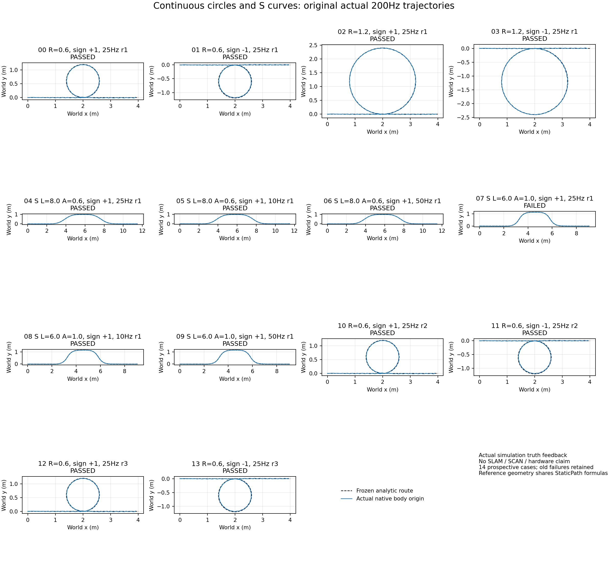
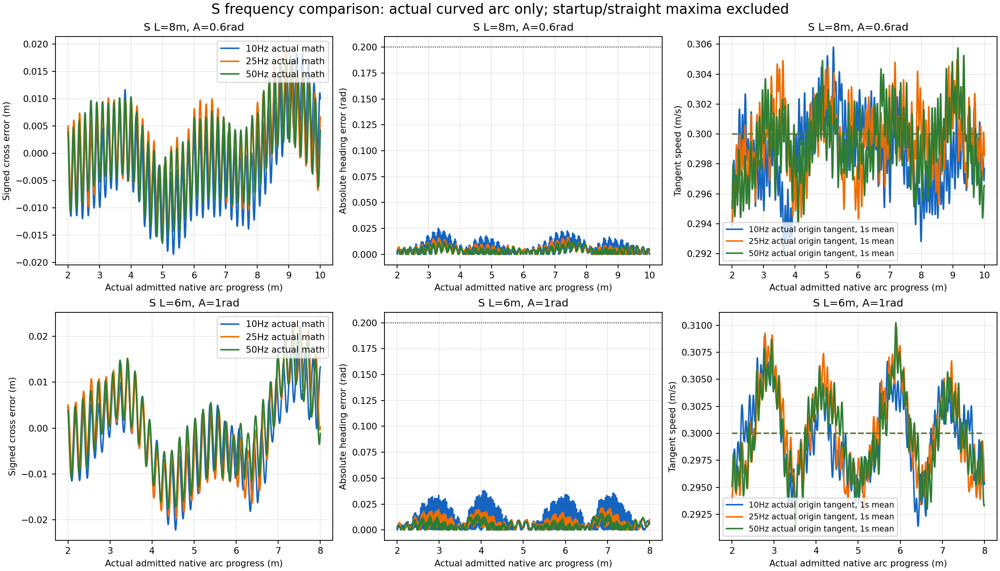
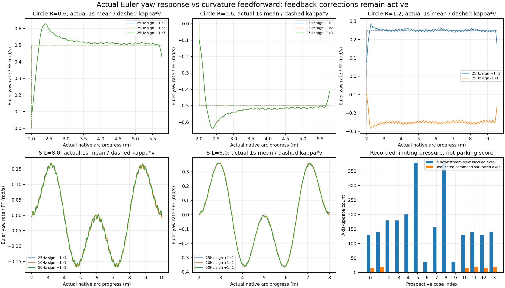

# 14轮实际连续曲率试验汇总

事前索引0–13完整，原新增15门共208/210通过。实际曲线完整收据通过13/14；其中连续drive动态7门通过98/98，动态全通过的run为14/14。本汇总保留原整体结论13/14通过；14/14来源哈希与独立物理重建复核一致。所有旧失败和原共同验收保留，score恒为null。

这些试验使用实际Gazebo原生反馈控制Teacher，是仿真真值控制基准，不是SLAM导航。Actor仍有232维特权观测，3维命令和12维上一动作；模型未重新训练。

|索引|路径|Hz选定/实际数学更新|原状态|横误差RMS m|朝向峰值 rad|沿切线origin均速 m/s|停车XY/yaw|
|---|---|---|---|---|---|---|---|
|0|圆R0.6 sign+1 r1|25/25.000|passed|0.008743|0.181943|0.297375|0.007026/0.022965|
|1|圆R0.6 sign-1 r1|25/25.000|passed|0.010189|0.176213|0.297386|0.009107/0.092986|
|2|圆R1.2 sign+1 r1|25/25.000|passed|0.006255|0.048425|0.297943|0.011103/0.087254|
|3|圆R1.2 sign-1 r1|25/25.000|passed|0.007291|0.049948|0.297862|0.018799/0.062604|
|4|S L8.0 A0.6|25/25.000|passed|0.006412|0.031547|0.297839|0.010499/0.068709|
|5|S L8.0 A0.6|10/10.000|passed|0.007252|0.031547|0.297166|0.011773/0.080288|
|6|S L8.0 A0.6|50/50.000|passed|0.006409|0.031547|0.297861|0.011287/0.045907|
|7|S L6.0 A1.0|25/25.000|failed|0.008299|0.031547|0.297358|0.004315/0.114522|
|8|S L6.0 A1.0|10/10.000|passed|0.007760|0.037993|0.297242|0.005364/0.032124|
|9|S L6.0 A1.0|50/50.000|passed|0.007531|0.031547|0.297533|0.010572/0.016866|
|10|圆R0.6 sign+1 r2|25/25.000|passed|0.008743|0.181943|0.297375|0.007026/0.022965|
|11|圆R0.6 sign-1 r2|25/25.000|passed|0.010189|0.176213|0.297386|0.009107/0.092986|
|12|圆R0.6 sign+1 r3|25/25.000|passed|0.008743|0.181943|0.297375|0.007026/0.022965|
|13|圆R0.6 sign-1 r3|25/25.000|passed|0.010189|0.176213|0.297386|0.009107/0.092986|

仅实际弧区（原native progress位于entry至entry＋curve_length）诊断如下，原验收数字不变。初始化/直线段的drive峰值不用于推断曲线动态频率差异。

|索引|弧区heading RMS / max rad|弧区cross RMS m|弧区origin速度 MAE m/s|弧区heading峰值物理时刻 s|
|---|---|---|---|---|
|0|0.043760/0.164017|0.009979|0.015718|11.090000|
|1|0.048027/0.176213|0.013064|0.014945|11.250000|
|2|0.007955/0.041759|0.006290|0.013492|10.850000|
|3|0.009056/0.049948|0.007242|0.013060|10.690000|
|4|0.005434/0.016529|0.006839|0.014812|28.485000|
|5|0.007565/0.025224|0.007881|0.013935|14.810000|
|6|0.004689/0.012552|0.006873|0.015324|28.585000|
|7|0.007447/0.021453|0.009602|0.013984|26.605000|
|8|0.012092/0.037993|0.008781|0.013137|17.305000|
|9|0.005765/0.016227|0.008692|0.014362|26.585000|
|10|0.043760/0.164017|0.009979|0.015718|11.090000|
|11|0.048027/0.176213|0.013064|0.014945|11.250000|
|12|0.043760/0.164017|0.009979|0.015718|11.090000|
|13|0.048027/0.176213|0.013064|0.014945|11.250000|

原新增15门由各run归档的同SHA分析器以write=False重算并对照原状态；原共同验收、profile、raw、执行源码和独立数组的哈希均逐项核对。原生姿态/COM/角速度来自每个physics_step，时间为t−dt（dt=.005），不是force应用时刻t。实际origin速度=COM−ω×归档COM偏移，再按原姿态转入world；COM沿因果参考速度投影与origin沿几何切线速度分别报告。

分析器重建实际native量并与原独立数组逐帧对照；局部单调弧长投影复用原哈希验证的独立曲线收据，StaticPath几何公式仍与归档控制器共享。因此测量与收据复核独立，不是完全独立推导的几何验收。未把bodyωz当Euler yawdot，也未把yawdot/v称为真实运动曲率。Euler yawdot与κv前馈不同还包括yaw反馈纠偏、内环响应和步态振荡；两者差值仅诊断，不新增或放宽验收门。

真实反馈Hz只统计controller_updated=true的不同原feedback头，排除初始化/hold/parking。Teacher仍50Hz，native仍200Hz。图中的1s平滑仅用于显示，所有门限和原始数组保留未平滑数据。请求命令限幅、Teacher实际slew和内环PI条件积分根据原始记录重建；未触及某限幅的试验不能宣称已压力验证该限幅。

S gentle(L8,A.6)、tight(L6,A1)各频率仅一轮；R.6每方向三轮，R1.2每方向一轮。不能仅凭停车分数、一次成功或这些有限场景宣称全局最优频率、最小物理半径或其他速度泛化。原规划profile中的旧plant重复验证字段保持原样，新增boundary收据链单独核验；未把旧unverified字段回填为passed。

紧S25原固定停车yaw漂移超过0.1rad时，完整项必须保留FAILED，即使连续drive动态全部通过；不挑更安静停车窗。停车阶段持续Teacher零速度命令，外/内PI绕过输出零，频率改变到达及足步相位可能间接影响最后漂移，不能说高频停车闭环已修复漂移。active velocity/pose hold属于未实现新契约。

紧左圆R0.6整体drive峰值0.181943rad出现在物理23.375s、native弧长5.979955m，已越过圆段终点5.769911m；因果control为23.370s、feedback为23.365s，此时κv已降到0，日志测得Euler rate仍为+0.016146rad/s，body rate参考−0.261769、实际Teacher命令−0.044809rad/s，yaw轴slew阻止积分为true。紧右圆峰值0.176213rad出现在11.250s、弧长2.250449m的入圆区，此时参考FF−0.5rad/s，yaw轴同时触发限幅与slew阻止积分。R0.6前馈跳变率12.5rad/s²，R1.2为6.25rad/s²，均高于下游wz slew 0.8rad/s²；这是连接处输入变化与响应误差关联的直接记录，不能据此证明唯一根因。紧左圆仅弧区峰值0.164017rad，宽左圆仅弧区0.041759rad。

S gentle弧区heading RMS在10/25/50Hz分别为0.007565/0.005434/0.004689rad；tight为0.012092/0.007447/0.005765rad。三种gentle的整个drive最大值都约0.031547rad，实际出现在3.030s初始化后直线起步段，不能据此声称三种频率曲线动态相同。弧区速度MAE也有各自变化，见表，不以单一heading或停车指标排序全球最优。

紧圈/宽圈朝向峰值在JSON中保留真实物理时间、因果控制头、弧长、前馈变化和±0.3s固定上下文。圆与直线连接处曲率可发生跳变，κv变化率与实际slew/限幅相交仅为时间关联证据；渐变曲率或限速需事前冻结的同场景A/B才能确认改善，当前没有该因果实证。

SCAN、实际SLAM曲线、多层、动态障碍、新曲线律Isaac对照及真机仍未验证。

完整来源、逐项状态、PI重建与固定停车统计见[aggregate.json](aggregate.json)；独立诊断数组为[actual_curve_arrays.npz](actual_curve_arrays.npz)。[人工像素QA](pixel_QA.json)已检查三图通过；[来源/重建复核](source_reconstruction_audit.json)14/14一致，失败的tightS25保持原整体FAILED。
