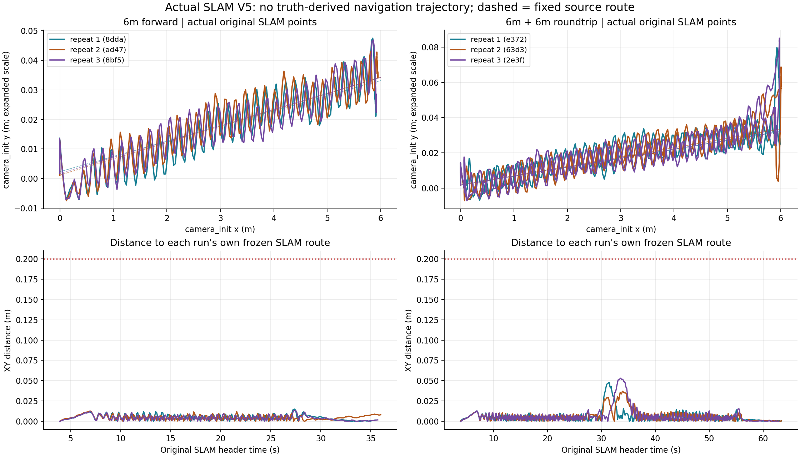
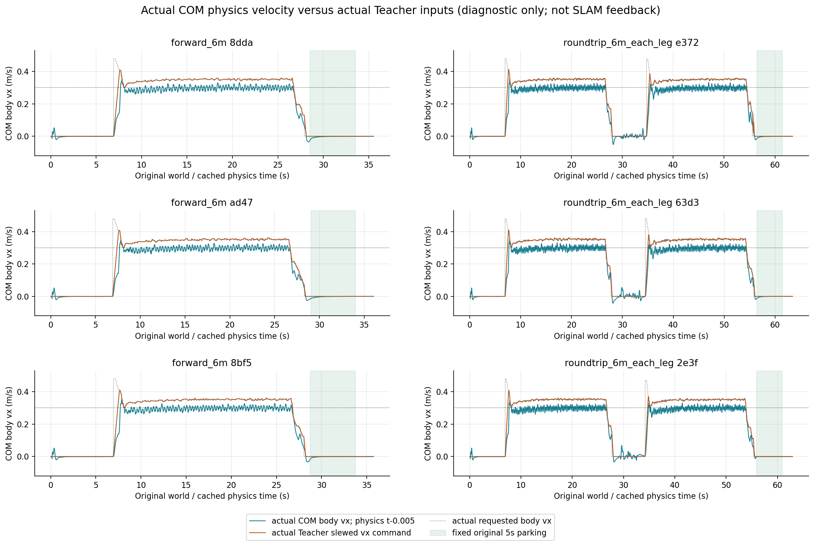
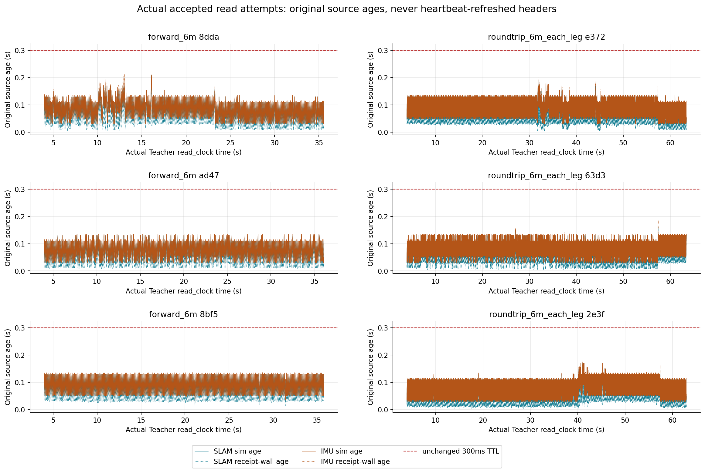

# 实际 SLAM V5 六次固定路线汇总

六次试验（6m 单程三次、6m＋6m 往返三次）均通过原独立验收，共 132/132 门。此次汇总重新读取所有原输入 SHA，并以原冻结分析器 `write=False` 复核，没有修改旧日志、源码或收据。

选定 CAS25 的 controller/gains 保持，真实 SLAM 新源控制率均约 10Hz；这是显式降率迁移，不是 SLAM25。目标速度为 0.3m/s，不能据此声称已实测 1m/s。

| 试验 | 实COM均速 m/s | 速度MAE m/s | 路线最大/RMS m | 朝向峰值 rad | 5s停车XY m / yaw rad | 原SLAM头 / math更新 |
|---|---:|---:|---:|---:|---:|---:|
| 单程 8dda | 0.296490 | 0.012175 | 0.025518/0.009610 | 0.054990 | 0.014063/0.080430 | 318/217 |
| 单程 ad47 | 0.296561 | 0.011822 | 0.019609/0.008787 | 0.054990 | 0.009438/0.083804 | 323/222 |
| 单程 8bf5 | 0.296715 | 0.011546 | 0.025664/0.009130 | 0.055208 | 0.007801/0.069798 | 320/219 |
| 往返 e372 | 0.293541 | 0.014656 | 0.027575/0.008600 | 0.066220 | 0.008896/0.045306 | 597/496 |
| 往返 63d3 | 0.293474 | 0.014936 | 0.035993/0.008410 | 0.069005 | 0.006762/0.059709 | 597/496 |
| 往返 2e3f | 0.293695 | 0.014728 | 0.035678/0.009464 | 0.070729 | 0.003627/0.006272 | 592/491 |

全组最坏：路线最大 0.035993m、RMS 0.009610m，行驶朝向 0.070729rad；RP 0.113963rad，最低离地 0.275679m。最大力矩命令 14.623962Nm、qd 13.716193rad/s，机身接触与 fault 均为0。力矩是 physics 的施力命令，并非测得电机力矩。

保持原门限：路线最大/RMS 0.20/0.08m，行驶朝向0.2rad，速度MAE≤max(0.05,0.25×参考)，原SLAM末目标0.15m与不同原头连续0.6s dwell；固定首个合格停车窗5s，位移/偏航≤0.05m/0.1rad；RP≤0.65、clearance≥0.18、force≤23.50001、qd≤30.001。每窗原生1001帧、Teacher251帧、真实SLAM50个不同原头。六主进程与六SLAM子进程全部干净退出。

六次合格读包均无未来SLAM/gyro反馈、无源TTL违规。SLAM sim龄峰值 0.210000s，IMU sim龄峰值 0.210000s，SLAM墙龄峰值 0.189026s，IMU墙龄峰值 0.212106s，均小于原300ms限制。197/196次读取拒绝均位于首次合格包前的正常预热；首次接受后均无拒绝。

V5只修复原子JSON读取开始与生产者写入之间的时钟竞态：读取该版本完成后再评估其墙龄，并记录 read_begin / read_completed / read_span。原始传感头及接收墙钟不刷新，300ms TTL、50ms producer-clock相位容差、Teacher、physics、gains、slew、controller core 与 runner 都不变。V4原成功/失败收据保留并单列在 JSON 中；不回填、不混计为这六次V5通过。

范围限制：高层定位/命令/到达来自实际SLAM和因果IMU；Actor仍有232/247维Gazebo特权观测，其余为3维速度命令与12维上一动作。固定route只由首次实际SLAM机身原点＋yaw锚定；旧场景绝对中心线和旧地图尚未注册。离线一次native对齐只用于实际运动评估，不能倒灌导航。SCAN、实时云避障、多层路线、曲线SLAM、通用Sim2Sim及真机均未验证，score恒为null。

完整路径、SHA、132门重新计算证据、原始来源统计、V4→V5源差异见 [aggregate.json](aggregate.json)。重现脚本为 [aggregate_v5.py](aggregate_v5.py)，仅向本新目录写入。

实际IMU字段纠正：本次V4/V5原始ROS记录均为 orientation_available=true、covariance全0；没有实际运行gyro-only姿态不可用分支。V2缺原raw，不得由静态SDF−1断定当时实际姿态不可用。NumPy bool身份/序列化缺陷及来源范围见 [README_IMU_SOURCE.md](README_IMU_SOURCE.md)。
