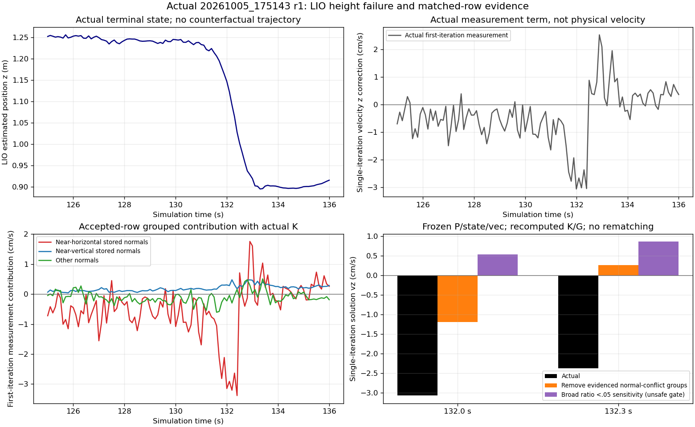
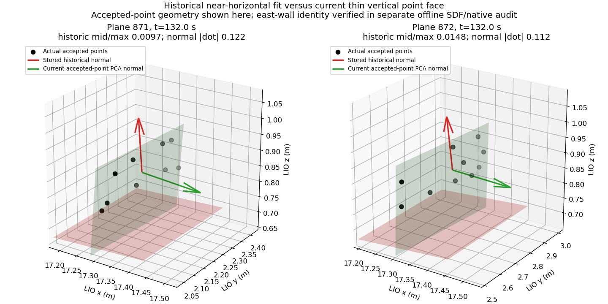

# v7 实际故障：LIO 匹配与高度更新审计

审计对象是 `20261005_175143_closed_loop_cascade_height_diag_baseline_r1_6fdf` 的实际 210 s 运行。原控制、Teacher、地图构建、匹配和求解运算均未修改；诊断副本的 off/on 合成 fixture 状态与协方差逐字节相同。实际桥首次 guard failure 为 clock **133.13 s**、SLAM source **133.099999999 s**（独立 physical/summary 的首次失败 envelope）；156.465 s是随后观测到的failed状态记录，不是首次故障或首次fence。本运行仍判失败。本报告是离线原因诊断，不能算修复、Sim2Sim 或导航通过。

## 当前证据结论

已经找到一个具体、可数值复现的前端问题：一些初始化早期创建并冻结的近线点集，被仅检查最小特征值的逻辑判为平面；其保存法向近水平面法向（`n≈z`），而运行到故障区域时分配给它们的实际点集已经具有薄竖面结构（当前 PCA `n≈x`）。这些错误方向的 accepted rows 通过原 3σ 门，并经 ESIKF 的位置/速度协方差耦合向下修正 `pz` 与 `vz`。

这不是“水平地面特征少”一项统计推测：实际 H、权重、残差、P、K、G 可以重建到浮点精度；逐点贡献和限定单帧移除实验都显示上述组对故障窗口负 `vz` 更新有实质贡献。严格几何冲突组移除后，132.0 s 单迭代负修正减少约 61%，132.3 s 负修正反转为很小的正修正。但完整轨迹尚未重跑，错误组不是唯一原因的证明。

独立的 [SDF/坐标/实际 LiDAR 点几何审计](../actual_r1_plane_geometry_audit.md) 已确认这些约束中的主体是 `wall_18.5` 的竖直室内面；坐标经过离线转换，该面为 world `x=18.4`。132 s 的近水平组中209条实际点来自该东墙，其净 `Δvz=−.030867 m/s`，占546条近水平组净负影响的98.02%。这将错误方向约束落实到了真实场景实体。Gazebo native 真值只用于离线核对，从未进入导航或 LIO 更新；不能把 LIO `x≈17.4` 直接当成世界坐标。物理运动与 IMU 传播分担见独立 integrity/runtime 审计。

## 证据完整性与可复现性

冻结 schema SHA256：`13b40541a29d5f0bc7a1e5cc6edc5ea497a01b3d07753ec175016069aada3e33`。记录数 159757，writer 0 drop、无 IO error；本分析使用索引 seek 读取 LIO kind100–103，未把 6.44 GiB 全部常驻内存。

`summary.json` 包含源索引哈希、选取的 LIO record 流哈希、schema 哈希及实际 writer 统计。LIO 8885 次 iteration，第一/末实际 iteration 详情 1002 份。原 solution 重建最大绝对误差 `4.33e-16`。两份关键单帧的 M 相对 Frobenius 误差分别 `2.06e-15`、`1.52e-15`，solution 最大绝对误差 `1.39e-16`、`3.90e-17`。M 的绝对误差约 `1e-7` 是因 M 本身数量级大，不能只报绝对数值而暗示重建失败。

actual runtime 源与 schema 已冻结；下面脚本只写 `analysis/`，不修改匹配或运行源。

```bash
cd /home/hyh001/projects/1.Project/Ros2_fastlivo2_
task_analysis=multifloor_demo/teacher_mode/navigation/closed_loop_multifloor_v7/analysis
task_records=multifloor_demo/teacher_mode/runs/20261005_175143_closed_loop_cascade_height_diag_baseline_r1_6fdf/fastlivo_diagnostics/records.bin
OPENBLAS_NUM_THREADS=1 OMP_NUM_THREADS=1 python3 "$task_analysis/analyze_lio.py" --records "$task_records" --out "$task_analysis/actual_r1_lio"
OPENBLAS_NUM_THREADS=1 OMP_NUM_THREADS=1 python3 "$task_analysis/examine_plane_degeneracy.py" --records "$task_records" --out "$task_analysis/actual_r1_lio"
OPENBLAS_NUM_THREADS=1 OMP_NUM_THREADS=1 python3 "$task_analysis/offline_counterfactual.py" --records "$task_records" --out "$task_analysis/actual_r1_lio" --times 132 132.3
OPENBLAS_NUM_THREADS=1 OMP_NUM_THREADS=1 python3 "$task_analysis/plot_lio_fault.py" --results "$task_analysis/actual_r1_lio"
```

## 实际故障窗口和方向性贡献

本次实际 terminal LIO `z` 在 130.0 s 为 1.244232 m，131.0 s 为 1.232825 m，132.0 s 为 1.146329 m，132.5 s 为 1.001612 m，133.0 s 为 0.919208 m，134.0 s 为 0.900354 m。主下降窗口应使用本次 131–134 s 证据，不能机械套用旧 V6 的 128 s 窗口。首次桥保护已在clock133.13 s触发；156.465 s只是后续failed状态记录，不能用作首次故障或首次fence时刻。

首实际 iteration 的 `vec=state_propagat−state_iter` 在 132.0、132.3 s 均全零，所以这两次 solution 中没有 prior/迭代项混淆。每点测量对 `vz` 的贡献严格为：

`dot(K1[9,0:6],H_i) * R_inv_i * meas_i`。

不能把后续 iteration 的全 solution 都叫残差贡献；一般要另算 `vec−G*vec[0:6]`。这已经在 `aggregate_iterations.json` 分开。

132.0 s 首 iteration 的实际统计：

| 组 | accepted 点数 | 测量 Δvz（m/s） |
|---|---:|---:|
| 全部 | 3369 | −0.030664 |
| 保存法向近水平面：`abs(nz)>=.85` | 546 | −0.031490 |
| 保存法向近竖面：`abs(nz)<=.20` | 2458 | +0.003073 |
| 其他方向 | 365 | −0.002247 |
| 冻结地图模型 | 3358 | −0.030478 |
| primary voxel 关联 | 3367 | −0.030658 |
| actual fallback neighbor | 2 | −0.00000557 |

近水平组内部确实存在向上纠正：负项合计 −0.068230、正项 +0.036740；不能把全部近水平点都称错配，也不能说地面从不反向纠正。例如 plane870 本帧贡献 +0.001969 m/s，其历史 mid/max≈.865，当前 PCA 法向与历史法向夹角余弦绝对值≈.991（仅4点，独立法向稳定性证据较弱）。

125 s 至 132 s，首 iteration 近水平 accepted 点从 886 降到 546；原始 `M55` 与条件化其他5维的 Schur 信息同时下降。132.0 s Schur≈91878，而125 s≈420837，约下降78%。它仍明显非零，所以不能说完全失去 z 可观测性。M6 混合米与弧度，未按 characteristic length 归一；这些只作为同配置的相对几何代理，不作为物理条件数结论。

历史 near-line 近水平模型（mid/max<.05）在125 s占近水平点302/886≈34%，132 s占345/546≈63%。因此较可信水平约束减少与旧退化模型占比增大可以共同放大负修正；先后因果仍需 matched rerun 区分。



## 具体错误方向模型

plane871：历史中心 `[17.313198,2.253239,.679299]`，法向 `[-.052879,-.001456,.998600]`。历史协方差特征值 `[1.085e-5,.000200647,.0205923]`，mid/max=.009744。出生3.8 s，共更新8次，最后5.7 s；本帧冻结。

132.0 s 它实际采用9点：x=17.2909–17.3204、y=2.0553–2.4048、z=.7853–.8991 m。当前点集 PCA 特征值 `[4.345e-5,.00235756,.0164992]`，mid/max=.14289，最小方向 `[.99705,-.03180,-.06991]`；与保存法向 `abs(dot)=.12249`，明显近正交。其历史平面残差为 +.1067–.2193 m，组测量 `Δvz=−.003437 m/s`。

plane872：历史中心 `[17.323083,2.754688,.681587]`，保存法向 `[-.093382,-.004346,.995621]`，mid/max=.01475。当前10点二维展开的 mid/max=.07449，当前最小方向 `[.99855,-.05028,-.01934]`，与保存法向 `abs(dot)=.11229`。该组贡献 −.003131 m/s。

这些值的意义是旧模型方向与目前实际采用点的几何不一致，并不只是“向当前机身XY外推一个奇怪高度”。历史中间特征值小意味着近线、法向不够可辨；不等于严格数学 rank1。本帧多数可证实冲突的点在 LIO `x≈17.29–17.45` 的远端竖面带；当前 accepted 点覆盖约 y=2.05–5.88、z=.69–2.29 m。独立审计用初始6.8 s配对/native姿态和真实LiDAR外参验证，其中10个代表模型对应点全部在东墙有限范围内，world x≈18.386–18.423；墙 y∈[−3.5,10.5]、z∈[0,4]。楼板 `floor_2` 仅到x=18.0、`landmark_4` 仅在x≈16.95–17.45，不是这些点的表面。

另一个机制核对解释了早期错误法向何以出现：实际32×480束、竖直角−30°到+15°、8mm range噪声的扫描，在初始化距墙约17m时，相邻近水平环的高度间距约 .431m，接近 .5m体素大小，常只给一个扫描环。靠近后距墙约2.39m，环间距约 .061m，同一体素获得了二维面信息，但旧面已冻结。独立SDF射线解析在代表体素确实只预测一个ring，且预测计数47–53与最后refit48点相近。**早期实际原始点与成员未保存**，该解析只是带明确假设的机制核对，不是实际噪声/建图重放，也不是修复测试。



为什么仍通过关联门：保存平面法向/中心协方差产生的投影不确定性较大。871 本帧 candidate sigma 中位约 .006048 m²，其中 plane 项 .006010、query 协方差项 .0000387；872 相应 plane 项 .011347、query项 .0000437。因此不能说主要是当前位姿协方差过大。原 `abs(residual)/(3*sqrt(candidate_sigma))` 最大分别 .969/.978，正好仍在门内。solver 保留平面协方差但使用 body covariance 而非含 pose 的 query covariance，权重仍约36–260；很多同类组形成累计方向性误差。

## 限定单帧 counterfactual

冻结原 P、state、vec、实际 H/R/residual。只移除几何冲突组，重新求 M、HTz、K、G、solution，所有其余 rows 不改。严格证据条件为：当前该 plane 采用至少6点；历史 `abs(nz)>=.85`、mid/max<.05；当前点集 mid/max>=.05、RMS最小厚度<.015 m、当前/历史法向 `abs(dot)<.2`。这些是事后诊断规则，尚未成为任何生产门槛。

| 首 iteration | 实际 Δvz | 几何冲突组移除后 Δvz | 实际 Δpz | 移除后 Δpz | 移除点数 |
|---|---:|---:|---:|---:|---:|
|132.0 s|−.030664 m/s|−.011839 m/s|−8.797 mm|−3.601 mm|119/3369|
|132.3 s|−.023715 m/s|+.002667 m/s|−7.599 mm|−.322 mm|153/3619|

原 K 下两帧移除组分别贡献 −.020327、−.026832 m/s；重新求 K 后的数字不能通过简单减掉旧贡献替代。`single_iteration_counterfactual.json` 保留完整 baseline 与 variants 的解、prior、按 plane 贡献及几何证据。

宽泛“全部近水平且 mid/max<.05”移除会分别去345、373点，Δvz变为 +.005388、+.008684 m/s，仅供敏感性参考。真实地面薄扫描弧也可能 mid/max 小，盲用这个门可能损失正常地面/坡道约束。当前没有新的闭环或地图重建，也没有 covariance/IMU 传播重跑，不能声称它解决了导航。

`temporal_counterfactual/single_iteration_counterfactual.json` 保存125–135 s十一帧同规则对照：冲突组在下降前已存在，在132附近负修正增大。每帧是独立 frozen-state 实验，不可连成“修复后轨迹”。

## 代码中的机制与独立缺陷

v7 `slam_ws/src/fast_livo2_core/src/voxel_map.cpp`：

- 134–170行 `init_plane`：只有 `lambda_min < planner_threshold`；中间特征值条件被注释。近线点集的最小特征值也小，单独此门不能证明支持二维面或可辨识法向。
- 199–217行及后续 `UpdateOctoTree`：按累积点数达到 max_plane_points 后停止更新。重复/近线点可以满足50点，点数不等于二维覆盖。这些关键模型实际已在5.7/5.8 s冻结。
- 900–943行 `build_single_residual`：半径3倍门、candidate sigma 与概率门允许上面的近正交关联；已经记录实际 accepted rows，并未修门。
- 500–548行求解：H只直接测量旋转和位置，但通过19维 P 与 IMU传播产生的 p-v 跨项，同一残差可以修改 vz。132.0 s P[pz,vz]≈3.7948e−5。这是正常滤波耦合，问题是输入约束方向和模型质量，不应直接把速度更新关闭来掩盖。
- BuildResidualList 的 fallback：确定存在 `p_world/voxel_size` 无量纲坐标与米制 voxel center/quarter_length 比较的量纲缺陷。详情全窗1,301,952次 fallback 尝试中1,275,720次实际/正确量纲邻居key不同。但 132.0 s实际采用 fallback仅2点，直接贡献很小。遗漏更正确的地面补偿点仍可能间接削弱约束，尚未执行正确邻居的实际匹配 AB，不能把这个bug定为唯一根因。

此外负坐标的整边界索引“负整数再减1”也有 floor 差异，但本故障的主体远端点为正坐标，未证明其触发。本轮诊断刻意保留这两个代码缺陷，以免将加日志与修复混在同一次实际运行里。

## 建议后续分离实验

1. 独立副本只改 neighbor 米制比较，按同初始化/命令/随机种子 rerun，记录实际新增关联方向与 state 分担；不要同时改模型门。
2. 独立副本处理平面可辨性：近线模型不应因为点数多就被赋予可冻结的任意法向；待当前二维空间覆盖和稳定法向明确时再更新/替换。阈值必须依据体素尺寸、扫描采样和正常坡道/薄地面证据制定，不照搬本报告事后 .05。
3. 记录匹配组当前空间覆盖、模型法向变化与冻结可信度，验证正确地面向上补偿是否保留。单独 robust residual 门未必足够，因为这些错误模型用大 plane variance 后标准化残差本来就在3σ内。
4. 将局部信息指标按合理 characteristic length 归一，并结合正常场景验收；弱观测时保护导航输入，而非以位置比例硬钳制掩盖 z 漂移。
5. 与 IMU传播、VIO纠正及真值物理运动审计对齐窗口。后端回环用于全局一致性，不能替代这次当前帧法向错误的前端修正。

保留：实际故障、所有原始日志、索引和哈希、旧失败、有限 counterfactual 的条件与结果。未通过项目仍为未通过。
