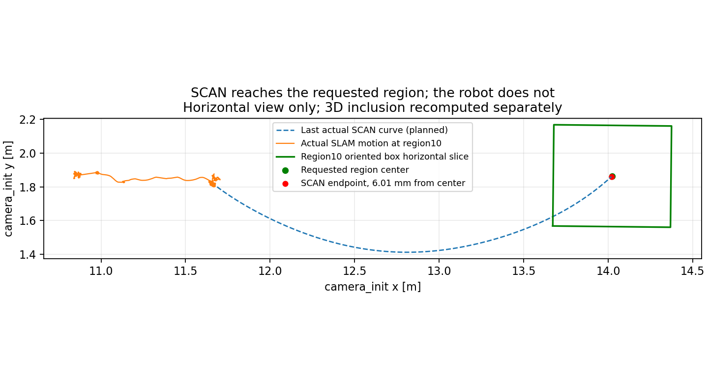
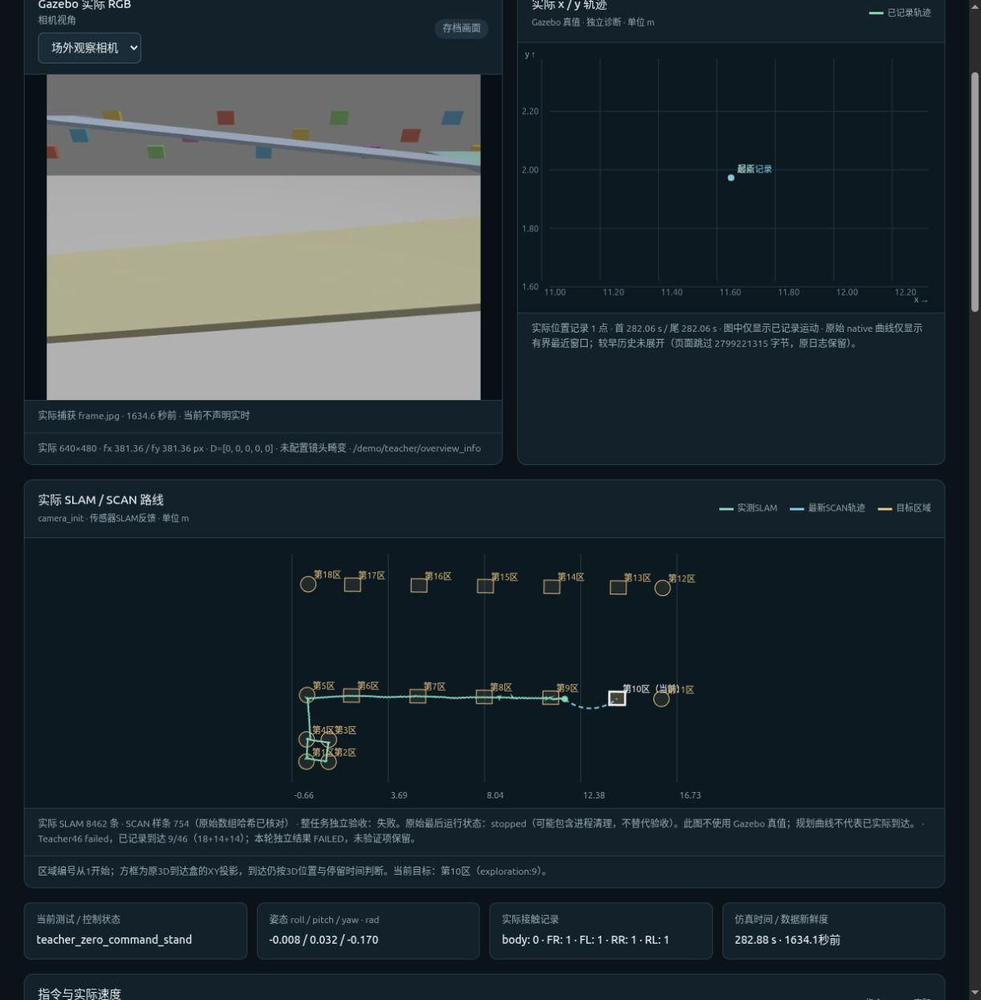
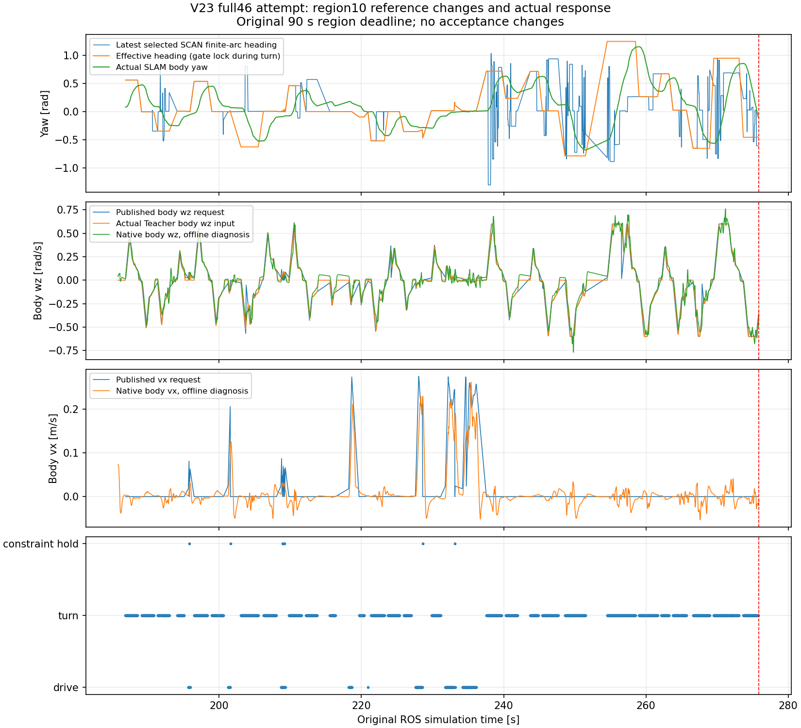

# 曲率开启后的原完整46区域实际尝试：V23

2026-10-06 已实际执行原18探索＋14返航＋14导航任务；并非只启动前九区。运行 `20261006_165823_closed_loop_cascade_clock_hold_curvature_on_V23_full46_r1_57fa` 实际到达9区，第10区按原90秒航点期限失败。任务未跳过第10区，后续阶段没有执行。独立结论为 **FAILED**，22项检查为10通过、4失败、8未验证。先前V22九区有限PASS保持原字节，不替代本轮。

## 第10区是否被SCAN绕过

SCAN接收目标坐标，不维护“第10区”编号；编号和顺序由原任务层管理。当前第10区为零基索引9、`goal_id=exploration:9`，原camera_init中心为 `[14.0242077032,1.8645988267,1.2033229588]`，到达盒沿坡/横向/法向半尺寸分别为 `[0.35,0.30,0.10]` m，停留0.4 s。任务、目标定义和期限未改。

实际轨迹225/272/481的伴随metadata明确waypoint_index9，body_goal和adjusted_body_goal均为原第10区中心；没有把目标移到其它区域。SCAN局部规划horizon为2.5 m，早期局部曲线可以尚未进入目标盒，不能把局部终点误当成拒绝目标。最后实际样条 `000750_trajectory_754.npz` 的350个采样点中78个位于原三维到达盒内，终点为 `[14.0198135008,1.8605027930,1.2031231561]`，距中心 **6.0105 mm**。这是规划能够到达区域的证据，不是机器人实际到达的证据。

狗的最后真实SLAM位姿在原到达盒坐标中为 `[-2.375863,-0.054218,-0.001261]` m，沿坡方向仍差约2.376 m，未进入目标盒。[几何数值及NPZ哈希](57fa_diagnosis/REGION10_SCAN_GEOMETRY.json)保存原输入、轴向投影和逐点三维包含判断。



网页原先只绘制含`radius_m`的圆形区域，漏画坡道`oriented_box`，并用零基ID当标签。这是显示缺陷，不是SCAN目标选择缺陷。已补原三维到达盒的XY投影、从1开始的区域标签和当前目标高亮；三维到达判据未改。[7项几何显示检查](viewer_region10_fix/GEOMETRY_RECEIPT.json)及[浏览器核验](viewer_region10_fix/BROWSER_RECEIPT.json)保存来源。



## 失败原因与修复方向

第10区激活时刻185.795 s；worker在275.88 s观察到航点超时终态。原程序继续保留7秒停车记录，最后仿真时刻282.88 s，因此不能把282.88 s写作首次超时触发时刻。

第10区2539条PID记录包含1606次fresh数学更新。fresh数学帧dt之和中，turn约52.065 s、drive约5.735 s、reference_constraint_hold约0.205 s；此统计不冒充全部90秒状态覆盖。329个实际路径ID、328次数学帧换路表明参考频繁变化。转向命令与native机身角速度有同向响应；该区native记录没有命令过期。当前证据不支持曲率保护长期锁死或Teacher完全不响应转向。转向反馈仍有误差，不代表已获得最优PID或所有策略问题解决。

更具体的触发点是独立候选中的 `shared_controller.py` 原低速重规划分支：它把“alignment_hold=False、控制输出低速/零速、距离上次请求超过3秒”当作轨迹结束。转向完成后，cascade按原保护门首先返回 `recovering` 的精确零速度；该零速度不是路径耗尽，却触发 `samples=None` 和新的SCAN请求。实际例189.085 s恢复零输出，189.110 s新路径朝向由约+0.559变为-0.007 rad，又进入对准；198.950→198.990、212.110→212.145、273.590→273.600也存在该链。相关源码、PID/metadata因果证据见[详细诊断](57fa_diagnosis/DIAGNOSIS.md)及[机器可读终稿](57fa_diagnosis/FINAL_INTERLOCK_DIAGNOSIS.json)。

下一候选V24应只区分“受保护控制零”与“已证实的路径耗尽/缺少进度”，保留原反馈恢复、300 ms期限、零速度、点云/姿态/路线边界保护和90秒到达期限；不先调整增益、不关闭曲率、不实现跨帧解耦。当前V23报告不因后续修复或成功而回填。



## 实测范围

| 层级 | 本轮结论 |
|---|---|
| 模型/关节执行接口 | 原冻结CPU单线程Teacher、唯一执行器及运行来源核验通过；本轮不是完整部署认证 |
| 采样运动安全 | 14,145条原50 Hz快照无检查错误；最大roll0.0433、pitch0.1044 rad，最低离地0.2581 m，无Teacher fault |
| 原区域闭环 | 前9区原实际SLAM到达、停留与90秒期限均满足；第10区超时，完整46区失败 |
| SLAM与流水线 | 真实SLAM输入、已加载二进制及输入序列正常排空通过；174,546 accepted=delivered=committed，0 pending/canceled/rejected |
| 返回起点、保存RGB地图、最终14区、动态障碍、首次固定5秒停车 | 本轮未执行，未验证 |
| 新闭环完整Sim2Sim | 未认证；缺少匹配Isaac闭环对照和完整200 Hz/PI/全部SCAN几何重放 |
| 全真实传感器Actor、真机 | 未验证；Actor仍232维特权，导航只用实际SLAM/IMU/点云/SCAN |

三层连接为坡道，不能称真实楼梯。曲率前馈与限速两个开关均开启，数学/gains与已测V22一致。走廊仍shadow，没有保留旧计划的控制权限；新回环后端和IMU/LIO/VIO跨帧解耦没有实现。训练、已通过camera_mode和其它任务没有被停止或修改。

CPU Teacher推理p50=0.316956 ms、p95=0.4093802 ms。启动快照20逻辑CPU、load1/5/15约5.27/4.66/4.09，GPU利用率6%、显存1356 MiB；这是启动快照，不是完整过程性能剖析。停止原因为航点超时，不是磁盘中止。原存储合同为启动至少150 GiB、运行至少30 GiB、单run至多120 GiB；三者均未放宽。

## 哈希、证据与命令

- [完整独立验收](57fa_FULL46_ACTUAL_EVALUATION.json)：SHA256 `f31de15c57e27dfb558fc05e60794842ae90f68a072a314112ec8d021c6904a2`。
- [独立读取器复核](v23_actual_review/INDEPENDENT_57FA_REVIEW.json)：原22门不变，5项适配器有限测试通过；仅读取compact和小来源。
- [原输入/物理诊断compact](57fa_diagnosis/)及[绘图来源回执](plots_57fa/PLOT_RECEIPT.json)：原日志单遍提取，绘图不重新扫描raw、不补零或改写指令。
- 模型SHA256 `bfe7fbbffe85fdb60cac590f1a6080a10609011ab6a538a078381261e98fbd34`。
- V23原全任务profileSHA256 `6121ae1b097362adb0bd44f0e4da4459b8198ad219beed04323f2331d28e06ee`；prospective gateSHA256 `c66ae34981a877fbb439a84aaba5d2f9567553b443096be7edfd31c7d34f1d53`；实际source_manifestSHA256 `0966cf9174ea58b052aa37a0de040c64e17dbc22bac3b6154319dabdd2a1ebf7`。
- [网页精确副本回执](57fa_VIEWER_COPY_RECEIPT.json)：只有新增展示副本，不编辑原状态、源码、日志或验收阈值。

在原SLAM项目根目录执行以下命令，均另建run/输出，不覆盖旧失败：

```bash
# 已执行的完整46区V23配置；重跑会另建新run
python3 -B multifloor_demo/teacher_mode/navigation/corridor_tracking_v23_curvature_full46/run.py \
  --profile curvature_original46_on --label curvature_on_V23_full46_retest --domain 92 \
  --run-storage-root /home/hyh001/projects/1.Project/go2_teacher_pipeline_v19_20261006_runs

# 只读独立验收；输出必须是新路径
python3 -B multifloor_demo/teacher_mode/test_results/curvature_full46_20261006/evaluate_full46_v23.py \
  --run /绝对路径/新运行 --output /绝对路径/新独立验收.json

# 只读展示实际仿真记录
python3 -B multifloor_demo/teacher_mode/scripts/serve.py --port 8768
```

[已展示的实际仿真/真实SLAM路线与FAILED](http://127.0.0.1:8768/?run=20261006_165823_closed_loop_cascade_clock_hold_curvature_on_V23_full46_r1_57fa)。源包clone中的旧主机绝对路径gate不授权新主机运行；需要重新构建、冻结与实际验证。

## 存储边界

验收和诊断完成后，仅将本轮关闭run的17,631,175,192 B点云`.bin/.npy`无损压缩到 `/var/tmp/go2_teacher_curvature_20261006_archives/v23_57fa/v23_57fa_cloud_arrays.tar.zst`，压缩后5,748,944,944 B。逐文件完整解压SHA256/大小核对后，再删除原散文件；全局净节省11.0662 GiB，home释放16.4203 GiB。原PID/native/执行器/指令/相机/样条/source快照全部保留。原metadata及失败结论未改。

[存储回执](V23_STORAGE_FINAL.json)、[压缩逐文件清单](V23_CLOUD_MANIFEST.json.gz)、[删除回执](V23_CLOUD_PRUNE_RECEIPT.json)、[受限恢复工具](lossless_v23_57fa_clouds.py)保留。对全部点云raw重审之前，需要原字节恢复，不能将raw散文件缺失解释为已完成完整几何重放。

```bash
python3 -B multifloor_demo/teacher_mode/test_results/curvature_full46_20261006/lossless_v23_57fa_clouds.py restore
```

先前401b/dc50关闭run的云散文件也已在独立归档完整核验后回收，见[旧V20回执](OLD_V20_CLOUD_LOSSLESS_RECEIPT.json)。没有用symlink移动canonical run，避免破坏原来源合同。
