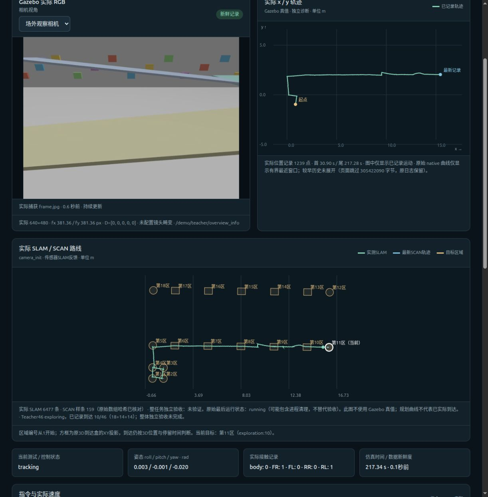

# V24恢复零速重规划修复与实际续测

本候选在独立目录`navigation/corridor_tracking_v24_recovery_replan`保留V23全部控制数学、曲率前馈与限速、原三维区域、90秒期限、300 ms反馈保护和唯一CPU执行器，只修复保护性零速度被低命令分支误判为路径结束的问题。真正的`path_end_hold`仍请求后续路径。跨帧解耦本轮不做。

61项有限测试、独立22项测试/36逻辑组合/6个实际末端边界案例，以及完整46区prepare来源闭合通过。该预检不代表实际导航通过。

第一轮27bd已实际运行原46区任务，到达回执记录11区，第10区实际通过；随后在sim267.18s接收到原runner的SIGINT/SIGTERM处理路径并被中断，完整任务未完成。原程序没有记录信号编号/发送者，无法归因其来源。保存的自有PID均退出，SLAM流水线168464输入正常排空。worker在清理时保存NPZ被再次打断，`worker_result.json`缺失，原完整22门读取器无法完成；不补造文件、不回填PASS。

中断末帧第12区真实SLAM XY误差约44.75 mm，z误差-172.059 mm，未满足原高度半径100 mm，因此接近目标不等于到达。native base_link origin world z=1.501709m，四足支持/无机身接触；这只是单帧离线物理记录，尚未证明整个高度误差的因果。不是把仿真真值送回导航。

[原读取器未完成回执](v24_evaluation/27bd_READER_INCOMPLETE_RECEIPT.json)、[信号与自有进程取证](v24_actual_observation/TERMINATION_FORENSICS.json)保存原失败边界。[预检与准许运行范围](v24_recovery_replan/FINAL_READY.json)明确冻结来源。另立实际SLAM三维到达目标审计，只核已完成区域，不替代整套22门、物理安全/停车或未执行的区域。

Teacher仍CPU单线程50Hz，关节物理执行200Hz，Actor仍有232维特权观测；导航反馈为实际SLAM/IMU/点云/SCAN。三层由坡道连接。新控制律完整跨引擎Sim2Sim、全真实传感器Actor和真机仍未验证。

## 第一轮中断前的独立目标核验

[独立部分目标审计](v24_evaluation/27bd_INTERRUPTED_TARGETED_AUDIT.json)单遍读取已停止的原SLAM和status两条流，原1–11区全部回执通过。第10区在205.265–205.690s的14个原SLAM源点全部位于原三维控制框，停留.425s、最大源间隔35ms、激活至到达51.59s≤90s。原沿坡/横向/法向控制半尺寸为[.25,.20,.07]m；该窗口最大绝对局部误差[.249081,.055915,.020050]m。完整46区仍未完成，缺失worker和原完整22门仍明确未验证。

该targeted报告SHA256为`574778d83713d3f075700944c2839c9656b44333216fca032548700c4a314f16`。原大点云将先无损归档并逐文件解压验证再删原件，冻结状态/源码/模型、SLAM与PID记录不变。

## 第二轮a87e：第12区通过，第13区软件异常后超时

同冻结V24控制来源，在独立进程组和新ROS域90重跑，实际到达12区后第13区按原90秒期限超时。运行正常退出、worker结果完整、SLAM流水线正常排空，无新的信号中断。原完整22门评价为FAILED（10通过、4失败、8未验证）；[本轮评价](v24_evaluation/a87e_FULL46_ACTUAL_EVALUATION.json)与[只读运行观察](v24_r2_observation/OBSERVER_FINAL_RECEIPT.json)另存。

具体软件错误是`terrain_provider.py`的`_record()`使用`dict(..., navigation_ground_truth_used=False, **value)`，实际合法切换proof也有该False字段，导致TypeError。187射线共享平台核验及provider切换已进行，但日志合并抛错触发失败锁存，Teacher持续零速站立。此时SLAM/SCAN新鲜，不是已证实的CPU不足或TTL反馈积压。独立V25将只修记录合并、保留非法truth标志拒绝和原所有切换/停车门；本轮失败保留。

术语校正：冻结C++执行器将`base_link.WorldPose().Pos()`原样写state.position，该位置是body link origin；速度另有COM定义。不能把state.position当COM位置再减偏置。仿真位置只用于离线检查，未参与导航反馈。
