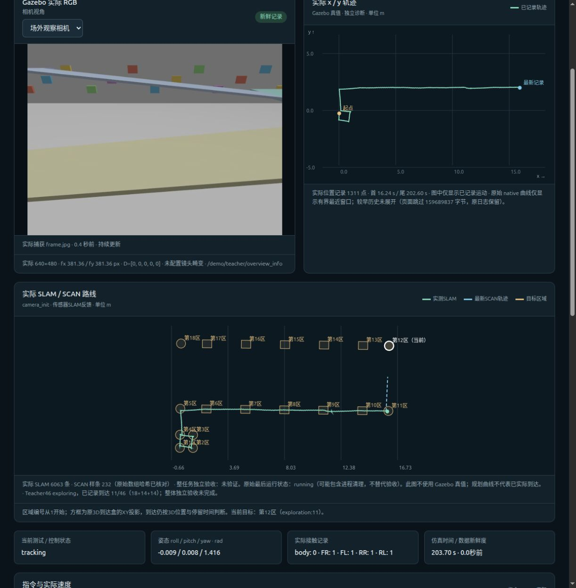
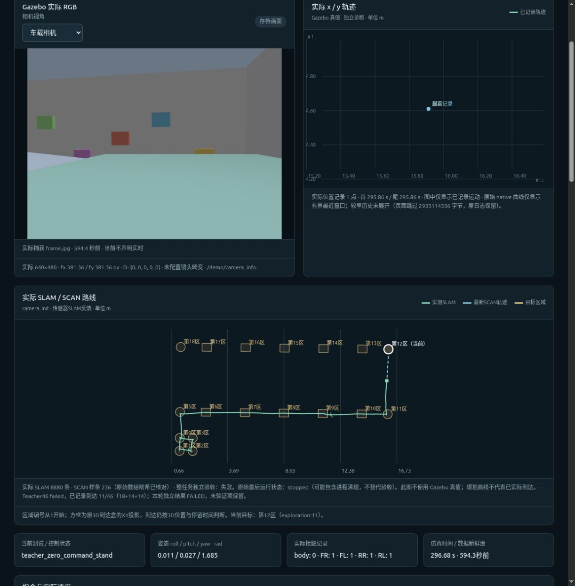
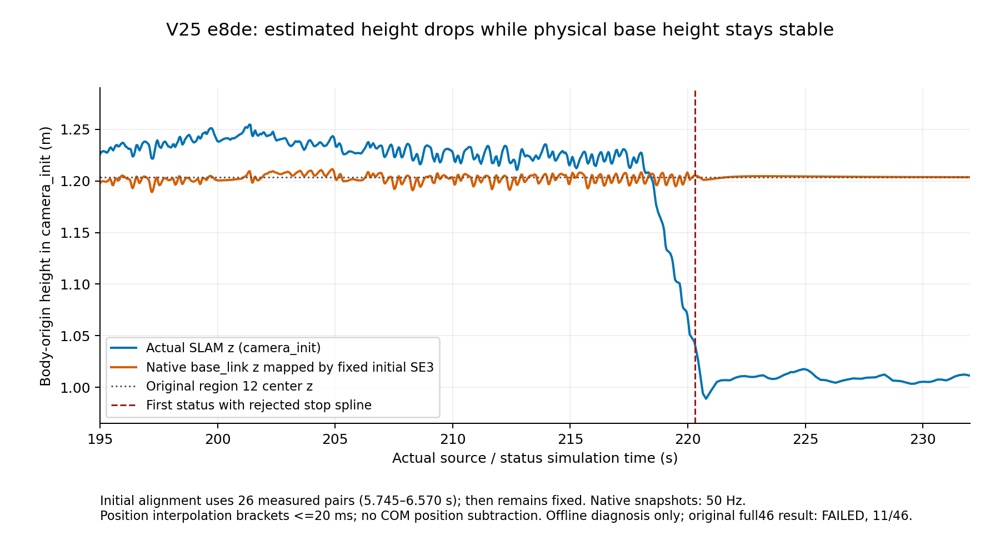
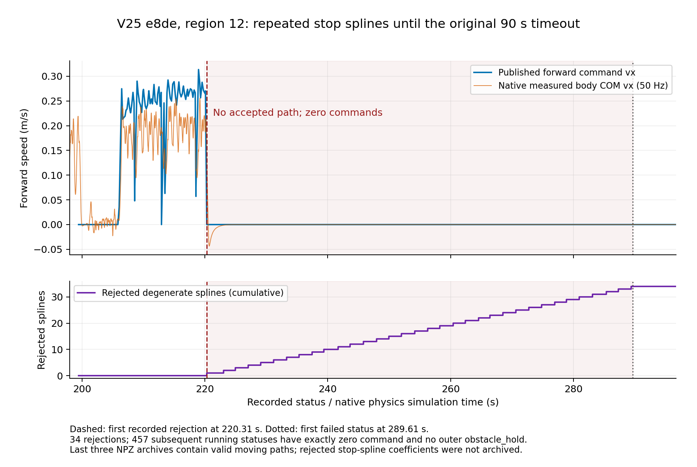

# V25地形切换记录修复与完整46区续测

SCAN并未跳过第10区。V23第10区末条样条终点距离目标中心6.0105毫米，350个采样点中78个在原三维到达盒内；机器狗未实际到达。页面此前遗漏了 oriented_box 类型区域，现已修正显示。V24两次实际SLAM运行都通过第10区，分别到达11区（信号中断）和12区（第13区失败）。原失败记录保持。

V24第二轮失败原因为Actor地形切换成功完成187点SDF验证后，事件记录函数的重复 navigation_ground_truth_used 关键字触发TypeError，随后保护锁存为零速。V25仅修复事件记录字段的合并，并拒绝任何非字面False的导航真值标志；采样、地形切换触发、控制增益、曲率开关、300ms新鲜度、原3D区域/停留/90秒期限均保持。

V25实际续测e8de正常结束，仿真296.68秒，实际到达11/46，第12区超时，原22门为10通过/4失败/8未验证。前11区原SLAM三维位置、连续停留和原90秒期限独立核对无错误；第10区137.705→186.685秒到达，停留0.430000001秒。有限测试63项通过不代表未触发的地形切换已实际验证。导航输入仅真实SLAM/IMU/点云/SCAN；Teacher Actor仍保留232维仿真特权输入。CPU单线程、唯一执行器，三层之间为坡道。完整200Hz执行器与完整PI/全部SCAN几何回放仍未验证，真机未验证。


## 实际结果与复现

- [原22门逐项独立报告](v25_evaluation/e8de_FULL46_ACTUAL_EVALUATION.json)：SHA256 `425438a744b66e5b7daad47f8068fcb39fda49f6cfe97d15e0b0cb80df1ec274`。没有继承V24、V22或其他历史PASS。
- [冻结V25准备核对](v25_terrain_event/FINAL_READY.json)：源码清单 `6a651de7d269dfcbfbfe1b890d5424bba4333d4178d1893c67ac4f98625c1395`，profile `1e05fcd7ea40a62fe9161de945eaf97fecdf13fca21bd51b98fbd823fb0d19b4`。原model哈希保持。
- 末帧实际SLAM约 `[15.945273,4.410316,1.008253]`，第12区目标 `[16.077283,6.839063,1.203467]`，距离XY约2.43m，不是只差高度即可到达。SCAN返回原地停车样条；Actor无fault，terrain仍initial/failure=null，没有完成任何切换，故本次不能实际认证地形事件修复。详细来源分析另存`v25_diagnosis/`，不得以最后成功归档的前进样条冒充未归档的停车样条。
- 14835条50Hz native快照的有限安全检查通过；这不是完整200Hz执行器回放通过。流水线输入正常排空，原执行器所有权和300ms保护保持。
- 周期只读observer收到未知来源SIGTERM，最后周期到sim197.38秒；退出后小状态sim248.18秒。实际隔离runner继续到正常结束。完整observer覆盖未验证，见[完整性收据](v25_actual_observation/OBSERVER_INTEGRITY_FINAL.json)。只读浏览服务曾同样退出，已用独立会话重新启动，不改变仿真结果。

原工作区实际执行命令（新机器须重建与重新预检，不能复用本机gate）：

```bash
cd /home/hyh001/projects/1.Project/Ros2_fastlivo2_/multifloor_demo/teacher_mode
setsid --wait /usr/bin/python3 -B navigation/corridor_tracking_v25_terrain_event/run.py \
  --profile curvature_original46_on --label terrain_event_V25_full46_r1_isolated \
  --domain 91 --run-storage-root /home/hyh001/projects/1.Project/go2_teacher_pipeline_v19_20261006_runs
```

本轮实际失败日志、原始PID/native/SLAM/SCAN样条与冻结源码保留，点云数组另做逐文件解压SHA核验后的无损压缩；原失败不回填通过。




## 高度与停车诊断的已知范围

[同时间固定坐标诊断](v25_diagnosis/E8DE_FRAME_AND_STOP_DIAGNOSIS.json)采用初始26对实测SLAM与native `base_link`位姿拟合固定SE3，只用于离线诊断；初始位置RMS小于1mm，后续native相邻20ms夹持匹配。217–218s时SLAM z中位1.22288m，固定变换的native z约1.20189m；225–230s时SLAM约1.00722m，native约1.20392m（差约-196.87mm），native世界base_link z仍约1.50231m。支持SLAM高度偏离，而不是狗机身同量下降；尚不能锁定IMU偏置/传播、LIO匹配或VIO更新之一。

220.31–289.39s的457条running状态命令全为精确零、接受路径ID为空，外层`obstacle_hold`均false；34次退化样条被拒绝。最后成功归档的3条SCAN样条仍是前进路径，不是这些停车样条；停车几何未进入成功归档，因此地图碰撞根因仍有证据缺口，不能认定是已验证的地面误占据。

[最终页面与车载记录](viewer_region10_fix/V25_FINAL_BROWSER_RECEIPT.json)已核对，浏览器显示本轮FAILED11/46、当前第12区，画面明确为终态存档。



## 点云存储清理

本轮17760份点云数组约18.37GB，已无损压缩至5.89GB，所有文件经流式解压逐文件SHA与尺寸核对后才删除原数组，跨文件系统净节省约12.48GB；PID/native/SLAM/SCAN样条/源码/原失败报告保留。归档路径`/var/tmp/go2_teacher_curvature_20261006_archives/v25_e8de/v25_e8de_cloud_arrays.tar.zst`，SHA `bae7788f39d5f858d770f900ba507a4201d89340e249c2d8dfb044654c9f9e4c`。

[归档清单](V25_E8DE_CLOUD_MANIFEST.json.gz)、[删除回执](V25_E8DE_CLOUD_PRUNE_RECEIPT.json)。完整几何回放前需在原目录恢复，命令：

```bash
python3 -B test_results/curvature_full46_20261006/lossless_v25_e8de_clouds.py restore
```


[SCAN停车源码与运行证据审计](v25_diagnosis/SCAN_STOP_SOURCE_AUDIT.md)确认连续50次规划失败触发紧急原地样条，后续近端碰撞/重规划失败循环。现有地面和障碍点都进入占据地图，.08m栅格的.12m配置实际按ceil膨胀至2格/.16m；这是代码语义记录，不代表已经证实该参数造成本次故障。SCAN的XY搜索/插值Z与固定Z梯度不能主动修正定位高度。未做新增规划参数调整。

后续优先在单次原第11→12区转向/平地段保存失败候选与碰撞体素、对应点云来源，区分SLAM高度修正、历史地图不一致和规划约束。需要前端逐更新预测/LIO/VIO状态增量记录才能把高度跳变分解，不能仅加快PID或直接忽略碰撞停车。跨帧估计器解耦继续按用户要求暂缓。


[最终诊断与来源清单](v25_diagnosis/E8DE_FAILURE_DIAGNOSIS_FINAL.md)、[紧凑数据绘图来源](v25_diagnosis/PLOT_PROVENANCE.json)。两幅曲线均由同一轮真实记录生成并核对，未使用补齐/伪造速度或位姿。




