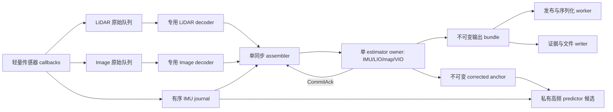

# 本地 FAST-LIVO2：工程队列与流水线审计

2026-10-05。只读审计主项目 `slam5_navigation/ros2_ws/src` 与 Teacher V12 独立 `slam_ws`。项目根没有 `src/`；本文的“主项目源码”指前述实际 ROS workspace。本次只新增文档，未改运行源码、保护文件、相机 Demo、训练或历史收据，未构建、跑物理仿真或性能基准。

V12 已实施并验证的改动是 LIO 每点独立字节槽、移除对应共享锁、4线程、保持原索引合并，以及有边界的诊断记录与可选计时。既有全路线验收见 [FULL_REPORT](../evaluation/FULL_REPORT.md)。**本文的接收/解码队列、独立预测器、输出快照等均为未实施候选；V12 实际通过不能作为这些候选已通过的证明。** 算法内部并行与区间 F/Q、相对 Delta 的边界另见 [ALGORITHM_PARALLEL_AUDIT](ALGORITHM_PARALLEL_AUDIT.md)。

## 当前分层和实际串行链

主项目的 ROS executable 仅创建 node 并调用 opaque `run_mapping()`；真正的订阅、同步和估计仍在 core 内 `LIVMapper`。runner 的注释明确要求不要在 ROS executable 暴露/构造依赖 Eigen/PCL 编译布局的具体 mapper 类型。可以继续保留这层 ABI，队列实现放在 core 的私有实现或 PIMPL，ROS 层只注入订阅/时钟/发布接口；不能把 mapper 裸指针作为跨线程公共接口。[main][runner-header][runner-source]

当前 V12 主循环是 `spin_some → sync_packages → handleFirstFrame → processImu → stateEstimationAndMapping`。没有独立传感器接收线程；估计、地图更新、彩色投影和若干发布处理期间，下一轮 callback 不会由该循环主动执行。[run]

```text
DDS buffer → callback decode/clone → shared deques
   → sync_packages（选 camera 时间、切点云/IMU）
   → Process2（IMU 初始化/传播/deskew）
   → LIO 校正 → odom → map update → cloud publication
   → 下一次同步返回同 camera 的 VIO → VIO 校正/视觉地图/彩色发布
   → 下一 camera 同步组
```

订阅队列深度使用 200000，内部 cloud、IMU、image deque 没有容量或源时间积压上界。深 DDS 队列能让接收暂时看似不断流，却允许旧源数据长期排队；深度不是吞吐修复。[subscriptions][fields]

标准点云 callback 在 `mtx_buffer` 内执行 `p_pre->process()`；图像 callback 先复制整条 ROS Image，再在同一 buffer 锁内完成颜色转换/clone。Livox 路径也在锁内复制消息和处理点云。它们是可拆的生产工作，而不是必须占用估计器状态的数学步骤。[cloud-callback][livox-callback][image-callback][image-decode]

## 第一候选：生产消费者边界

先保持原同步切分和单估计器，不跨帧重排 LIO/VIO。候选结构如下：



这一拆分主要让下一帧解码与当前帧估计重叠，让已提交结果的序列化与下一帧计算重叠。它不会让两个完整 ESIKF 更新并发写同一个状态，也没有保证总吞吐一定提高；须测源时间滞后、队列等待和实际 CPU 时间。仅把 `spin_some` 换成 MultiThreadedExecutor 不够：`sync_packages()` 多次在锁外读 `empty/back/front`、甚至 pop，估计器更新 `latest_ekf_state/time` 时没有使用 predictor 的 mutex；现状依赖主要调用在同一线程串行。[sync-entry][sync-livo][imu-prop][lio-anchor]

建议接口是数据所有权接口，而非共享 mapper 的方法调用：

```text
SourceEnvelope:
  stream, stream_sequence, epoch, raw_header_ns,
  effective_source_s, callback_entry_monotonic_ns, calibration_id
RawEnvelope<T>: SourceEnvelope + shared_ptr<const ROS message>
DecodedFrame:  SourceEnvelope + 独占 payload（交接后只读）
SyncGroup:     epoch + 原 source sequence/range + IMU range/predecessor
               + 原始 target time + predecessor CommitAck/version
CommitAck:     epoch + state_version + map_version + committed_lio_time
               + stage + initialization_status
OutputBundle:  epoch + state/map/camera version + source stamps
               + 自有 pose/cloud/image/diagnostic bytes
CorrectedAnchor: epoch + state_version + 完整 StatesGroup
                 + source time + IMU predecessor + mean_acc_norm + calibration
```

这是候选字段，不是已经部署的 schema。原 double 时间运算、偏移、5 ns 容差应保持原表达式；另保留整数 `raw_header_ns` 做来源身份与审计，不能以重新量化的 double 替代原 ROS stamp。`shared_ptr<const msg>` 可让 callback 保留原消息寿命并快速入队；其 payload 不能再被其他持有者写入。

### 解码所有权

每条流先使用一个专用 decoder，天然保持该流 source sequence。`Preprocess` 有 `pl_surf/pl_corn/pl_full/pl_buff` 等可变 scratch，当前对象由 mapper 共享，不能由多个 cloud worker 同时调用。若后续多个 worker 解码，必须每 worker 独立 scratch、固定校准版本，并有按 sequence 提交的 reorder buffer；后到的第 n+1 帧不能先改变第 n 帧的同步成员关系。[preprocess][preprocess-header]

图像的 `cv::Mat` header 复制不会冻结底层数据。`getImageFromMsg()` 有 alias ROS data、颜色转换与 clone；`VIOManager::processFrame(cv::Mat&)` 后续还 resize/原地灰度转换。候选可转交独占的 decoded image 给 estimator，或从不可变图像做私有工作副本；不能只加 `const cv::Mat` 就让估计、显示和下一帧复用同一 backing store。[image-decode][vio-process]

### 单 assembler 与提交屏障

必须保留 `sync_packages()` 的 source-time FIFO，而不是按 worker 完成时刻同步。LIVO 以 camera capture time 为目标，先创建 LIO，再返回同一 camera 的 VIO；instantaneous `lidar_type==0` 的容差只为 5 ns；IMU coverage 使用冻结配置的 `require_complete_imu` 分支，不应趁重构放宽。[sync-livo]

原点云切分会复制当前 frame 的 points，然后将点放入 `pcl_proc_cur/pcl_proc_next`，重基准 `curvature`；rolling scan 的未来点需要保留在下一组。组内 IMU 为 `(last_lio_update_time, target]`，传播还需要 `last_imu_` 的边界前驱。30 Hz camera、200 Hz IMU 平均每周期约 6.7 个样本；不能只取“最新 IMU”代替原序列。[sync-partition][sync-imu][imu-undistort]

assembler 不能在 estimator 完成前猜测下一组起点：`Process2()` 初始化可能早退，也可能将 `last_lio_update_time` 设到当前 target；正常传播也由 `UndistortPcl()` 更新这个 cursor。第一候选只允许一个 ready group、一个执行中 group，以 `CommitAck` 确认真实 cursor 后才组装下一目标。无需为了预取让估计器共享可变 `LidarMeasures`。[imu-process2][imu-commit]

初始化、时间回退或校准改变时，跨队列统一 `epoch`。先阻止旧 epoch 提交，再记录取消 sequence；在状态 owner 的屏障内重置成对 buffer、pending point carry、IMU 初始化/`last_imu_`、map/VIO 和 predictor cursor。当前控制保护将 ROS clock 回退锁定为 failure，队列重构不能悄悄改成自动继续。[clock-hold]

## 有界队列与背压

下面容量只是待验证候选，不能作为最终上线参数。需同时限制条数、bytes 和**原源时间跨度**，记录每条流的 oldest source age、入队等待、最大水位与消费 sequence。

| 队列 | 消费关系 | 有界策略与溢出行为 |
|---|---|---|
| IMU journal | estimator 与可选 predictor 两个独立 cursor | 活跃 300 ms 对应约60样本，1 s约200；初始化若需3 s则约600，还须保留前驱和安全余量。容量由实际初始化窗口/最大计算延迟预冻结；未被任一必要消费者消费的样本不得覆写。满队列即显式 overrun，禁止默默丢头。 |
| 原始/decoded cloud、image | decoder/assembler | 初始可评估2–4帧并有 byte cap，但原同步需要的所有帧仍应消费。满队列/源跨度超预算明确 fault；不能“latest only”跳过 camera、点云成员后宣称算法没变。 |
| prepared SyncGroup | 单 estimator | 第一候选一个 ready 加一个执行中，按 CommitAck 推进；避免多组持有同一 mutable point carry。 |
| 定位与导航输出 bundle | 发布 worker | 保持 FIFO、原 stamp 和 pose/cloud 对应关系。发布过期 bundle 不能刷新保护；拥塞要可见，旧源自然被300 ms期限拒绝。 |
| 可选 viewer 图片 | 显示 worker | 若独立标明仅显示，可 latest-only；不得影响原 raw image、导航点云、估计器或必需证据。 |
| 必需验收 evidence | writer | 必须有 attempted/written/error/sequence 收据；不能以丢日志让运行“变快”再当作完整验收。 |

有限内存、非阻塞生产、任意长消费者停顿和永不丢数据不能同时保证。这里选择正常窗口保留完整 IMU，越界记录 overrun 并使控制停止/估计候选失效。重新初始化是新 epoch 的独立动作，不把不完整旧轨迹继续当有效定位。

DDS 的200000深度也要纳入压力来源审计。缩短 QoS history 是可能的新配置，但会改变隐藏丢包/可靠性行为，需单独冻结与测 sequence，不能只改内部 deque 然后声称没有 backlog。接收 callback 应只做小对象封装、校验和入队；Image/LiDAR 解码队列满时不得长期拿住 IMU ingress 锁。

## 时间与控制保护不变量

`raw_header_ns` 是原设备源时间；`effective_source_s` 保留当前配置的时间 offset。`callback_entry_monotonic_ns` 是本进程第一次 callback 观察时刻，不能称 wire arrival：数据可能已在 DDS 队列等待。decoded/assembled/committed/published 的 wall time 仅用于延迟分析，不能替换 source 或 first receipt。

当前 Teacher 输入检查要求定位 frame/child、严格推进的 source stamp 和300 ms源年龄；clock hold 同时核原 ROS source age 与单调 wall receipt age，拒绝刷新相同原始消息。队列 worker 应继承同一 source identity。重复发布旧 pose、把 header 换为 now、或把 dequeue 时刻写作第一次 receive 都会破坏已有 freshness 含义。[teacher-input][clock-hold]

200 Hz predictor 产生的最近 IMU 姿态也不能冒充最近 SLAM 校正。须分开 `prediction_stamp` 和 `last_correction_stamp`，保留 raw IMU freshness、定位 correction age、source category/epoch；仍使用原300 ms保护，不能因为预测在推进而无限延长陈旧定位。

现有 `publish_img_rgb()` 使用 node clock now；这是处理结果显示图，不是 raw camera source。异步显示应保存真实 camera 时间作诊断关联，不能让该 now stamp 成为新的定位反馈证明。本文仅指出此边界，未改冻结源码。[image-publication]

## 状态、地图与发布的具体所有权

**规范状态只有 estimator owner 写。** `_state`、`state_propagat`、IMU 的 `last_imu_/last_prop_end_time_/IMUpose/angvel_last/acc_s_last`、VIO 的 `state` 指针和视觉地图都属于同一 causal update。VIO 初始化将 `state=&_state`；LIO/VIO 的 state update 与 rollback 会改完整状态，不能同时各自校正后合并。[components][state-fields][imu-undistort][vio-update]

现有高频传播读取 `latest_ekf_state/latest_ekf_time/state_update_flg`，LIO/VIO 写端没有同 mutex；timer 在锁前读取 `imu_need_init/new_imu/ekf_finish_once`。直接增加 executor 线程会暴露 torn anchor 与 flag race。可选新 predictor 应有私有 state，从一个不可变、完整 `CorrectedAnchor` 原子交接重锚，再从 retained journal 重放所有样本。现 predictor 非重锚分支只用 `newest_imu`，因此逐样本 journal predictor 是新行为，不能假称纯线程重构逐位等价。[imu-prop][lio-anchor][vio-anchor]

**map 查询只读阶段可并行，map commit 仍串行。** V12 residual 按 i 写独立 byte/result slot，隐式 barrier 后原索引合并。地图插入、OctoTree 更新与 sliding 删除会改变节点和指针寿命；不能一边 `BuildResidualListOMP/find` 一边对同一 tree `UpdateVoxelMap/mapSliding`。[residual][map-update][map-slide]

第一候选保留“本轮LIO查询完成→LIO状态→更新map→同camera VIO→下一查询”的屏障。若未来异步 map，必须快照版本/COW 节点、读者 lifetime 与 commit epoch 完整设计；让下一查询临时用上一版地图会改变测量关联，属于算法候选，不是透明 I/O 优化。

**输出 worker 只接收 snapshot，不持有 mapper/VIO/raw-map 指针。** 当前 LIO odometry 先发布，随后更新map、发布原LIO source stamp的导航点云；彩色 cloud 又用VIO帧的投影/图像。bundle应保存原stage source、state/map/camera version、变换和独占数据，保持原配对。不能分别latest-drop pose/cloud导致“新位姿+旧障碍”组合。[lio-publish][nav-cloud][colored-publication]

`pcl_w_wait_pub/pcl_wait_pub`、save cloud、static pending count、`new_frame_->T_f_w_` 与 image均会被下一处理重用。发布线程若只带这些 shared pointer，读取时内容可能已改变。应在 commit 边界完成所有权 transfer 或一次受控快照；序列化、PCD/image文件写可在 snapshot 之后处理。handleLIO/VIO与IMU日志中的同步 `ofstream/std::endl` 也可封装为带明确 StageContext 的记录，但不改变状态更新先后。

## 日志不是全部同步落盘

V12 diagnostics 已有独立 writer：生产端构造 `Record` 后进入有界256条/32 MiB队列，consumer锁外写binary/index，最后有 attempted/written/dropped/io_failed收据。主要逐点开销之一是生产 payload 的构造和复制，并不是每条记录都在估计线程同步写disk。[logger]

未来多 producer 不能继续读全局可变 `Logger::context_` 来隐式关联数据：`set_context()` 推进sequence/stamp/stage，worker晚发记录可能把上帧内容标到下一stage，甚至数据竞争。任务应带不可变 `StageContext`，显式 emit；保留原mandatory收据与来源链。选定3 s详细窗口以外没有逐点诊断是声明过的采集范围，不得伪造为“全程详细完整”。

## 具体失效点与候选防线

| 并发错误 | 对应现有字段/位置 | 结果与必须保留的边界 |
|---|---|---|
| cloud与header两个deque不同步 | `lid_raw_data_buffer/lid_header_time_buffer`；source回退只clearcloud | 点云与时间错配。新接口用一个 envelope；回退作为epoch事件，不能只清一列。[cloud-callback] |
| 无锁读front/back与另一线程pop | `sync_packages()`入口、LIVO组装/point切分 | 越界、use-after-pop、组成员不稳定；assembler独占解码队列。[sync-entry][sync-partition] |
| cloud worker共用scratch | `p_pre->pl_surf/pl_buff` | 跨帧点混合；每decoder独占Preprocess。[preprocess-header] |
| Image浅拷贝同时灰度/resize | `MeasureGroup.img`、VIO processFrame | 输入图与投影图变化；独占或不可变原图+私有工作图。[vio-process] |
| 提前推进cursor | `last_lio_update_time/last_prop_end_time_/last_imu_` | 少IMU/重IMU、错误dt、bias/cov连续性破坏；CommitAck推进。[imu-process2][imu-commit] |
| 读半更新的状态锚 | `latest_ekf_state/latest_ekf_time/state_update_flg` | state与时间不对应；不可变anchor一次交接。[imu-prop][lio-anchor] |
| map写/删除同时匹配 | `voxel_map`、OctoTree、plane指针 | plane数据竞争/悬挂指针；同版本只读期与commit屏障。[map-update][map-slide] |
| 旧epoch任务迟到提交 | queuedgroup、IMUpose、VIO frame、map版本 | clock/reset后旧轨迹污染新坐标；epoch核验后单owner提交。 |
| 重标时间制造“新定位” | sourceheader/firstreceipt | 绕过300ms保护；源身份不变、wall stages仅分析。[clock-hold] |
| 晚日志误用新context | `Logger::context_` | header与真实stage错配；任务带显式context。[logger] |

## 落地次序与验收范围

1. 新独立候选先实现轻量 callback envelope、每流专用 decoder、单assembler/单estimator；保持原FIFO、rolling point carry、初始化和完整IMU coverage。接收/解码可以并发，估计提交保持原序。
2. 另一个候选实现不可变输出bundle，异步序列化/文件写。先保留定位/导航 FIFO、原sourcestamp与完整验收记录；viewer采样独立。
3. 独立预测器若需要，再作为新source contract验证，而不是附带偷偷改变当前newest-IMU行为。地图快照/跨帧算法并行另立候选。
4. 每个候选预冻结后，用同实际输入核每流exactly-once sequence、IMU前驱和组成员、point curvature、state/cov、残差顺序、VIO接受/回退、源stamp、初始化和reset。延迟/乱序/overflow/epoch取消测试须证明旧输入仍被300ms拒绝，未消费IMU不静默丢失。
5. 数值对照采用相同CPU核型/编译条件；需要保持原运算顺序的阶段先做逐字节核对，若引入浮点归约改序就新列误差合同。通过这些还需同路线实际复测原32区域、双坡道与停车门，才能宣称新队列集成通过。

本次未实施/运行上述候选，也没有根据串行链猜测其加速倍数。先并行容易分离的点/patch计算与收发解码，比立即跨时段预积分或并发两个完整估计器更有可审核的依赖边界。

<!-- SOURCE_REFS -->
[main]: /home/hyh001/projects/1.Project/Ros2_fastlivo2_/slam5_navigation/ros2_ws/src/fast_livo2_ros/src/main.cpp:4 "main.cpp:4"
[runner-header]: /home/hyh001/projects/1.Project/Ros2_fastlivo2_/slam5_navigation/ros2_ws/src/fast_livo2_core/include/fast_livo2_core/runner.hpp:10 "runner.hpp:10"
[runner-source]: /home/hyh001/projects/1.Project/Ros2_fastlivo2_/slam5_navigation/ros2_ws/src/fast_livo2_core/src/runner.cpp:10 "runner.cpp:10"
[run]: /home/hyh001/projects/1.Project/Ros2_fastlivo2_/multifloor_demo/teacher_mode/navigation/lidar_sampling_v12/slam_ws/src/fast_livo2_core/src/LIVMapper.cpp:785 "LIVMapper.cpp:785"
[subscriptions]: /home/hyh001/projects/1.Project/Ros2_fastlivo2_/multifloor_demo/teacher_mode/navigation/lidar_sampling_v12/slam_ws/src/fast_livo2_core/src/LIVMapper.cpp:363 "LIVMapper.cpp:363"
[fields]: /home/hyh001/projects/1.Project/Ros2_fastlivo2_/multifloor_demo/teacher_mode/navigation/lidar_sampling_v12/slam_ws/src/fast_livo2_core/include/fast_livo2_core/core/LIVMapper.h:143 "LIVMapper.h:143"
[cloud-callback]: /home/hyh001/projects/1.Project/Ros2_fastlivo2_/multifloor_demo/teacher_mode/navigation/lidar_sampling_v12/slam_ws/src/fast_livo2_core/src/LIVMapper.cpp:986 "LIVMapper.cpp:986"
[livox-callback]: /home/hyh001/projects/1.Project/Ros2_fastlivo2_/multifloor_demo/teacher_mode/navigation/lidar_sampling_v12/slam_ws/src/fast_livo2_core/src/LIVMapper.cpp:1030 "LIVMapper.cpp:1030"
[image-callback]: /home/hyh001/projects/1.Project/Ros2_fastlivo2_/multifloor_demo/teacher_mode/navigation/lidar_sampling_v12/slam_ws/src/fast_livo2_core/src/LIVMapper.cpp:1169 "LIVMapper.cpp:1169"
[image-decode]: /home/hyh001/projects/1.Project/Ros2_fastlivo2_/multifloor_demo/teacher_mode/navigation/lidar_sampling_v12/slam_ws/src/fast_livo2_core/src/LIVMapper.cpp:1150 "LIVMapper.cpp:1150"
[sync-entry]: /home/hyh001/projects/1.Project/Ros2_fastlivo2_/multifloor_demo/teacher_mode/navigation/lidar_sampling_v12/slam_ws/src/fast_livo2_core/src/LIVMapper.cpp:1319 "LIVMapper.cpp:1319"
[sync-livo]: /home/hyh001/projects/1.Project/Ros2_fastlivo2_/multifloor_demo/teacher_mode/navigation/lidar_sampling_v12/slam_ws/src/fast_livo2_core/src/LIVMapper.cpp:1380 "LIVMapper.cpp:1380"
[sync-partition]: /home/hyh001/projects/1.Project/Ros2_fastlivo2_/multifloor_demo/teacher_mode/navigation/lidar_sampling_v12/slam_ws/src/fast_livo2_core/src/LIVMapper.cpp:1474 "LIVMapper.cpp:1474"
[sync-imu]: /home/hyh001/projects/1.Project/Ros2_fastlivo2_/multifloor_demo/teacher_mode/navigation/lidar_sampling_v12/slam_ws/src/fast_livo2_core/src/LIVMapper.cpp:1451 "LIVMapper.cpp:1451"
[imu-prop]: /home/hyh001/projects/1.Project/Ros2_fastlivo2_/multifloor_demo/teacher_mode/navigation/lidar_sampling_v12/slam_ws/src/fast_livo2_core/src/LIVMapper.cpp:851 "LIVMapper.cpp:851"
[lio-anchor]: /home/hyh001/projects/1.Project/Ros2_fastlivo2_/multifloor_demo/teacher_mode/navigation/lidar_sampling_v12/slam_ws/src/fast_livo2_core/src/LIVMapper.cpp:595 "LIVMapper.cpp:595"
[vio-anchor]: /home/hyh001/projects/1.Project/Ros2_fastlivo2_/multifloor_demo/teacher_mode/navigation/lidar_sampling_v12/slam_ws/src/fast_livo2_core/src/LIVMapper.cpp:525 "LIVMapper.cpp:525"
[preprocess]: /home/hyh001/projects/1.Project/Ros2_fastlivo2_/multifloor_demo/teacher_mode/navigation/lidar_sampling_v12/slam_ws/src/fast_livo2_core/src/preprocess.cpp:62 "preprocess.cpp:62"
[preprocess-header]: /home/hyh001/projects/1.Project/Ros2_fastlivo2_/multifloor_demo/teacher_mode/navigation/lidar_sampling_v12/slam_ws/src/fast_livo2_core/include/fast_livo2_core/core/preprocess.h:158 "preprocess.h:158"
[vio-process]: /home/hyh001/projects/1.Project/Ros2_fastlivo2_/multifloor_demo/teacher_mode/navigation/lidar_sampling_v12/slam_ws/src/fast_livo2_core/src/vio.cpp:2070 "vio.cpp:2070"
[imu-undistort]: /home/hyh001/projects/1.Project/Ros2_fastlivo2_/multifloor_demo/teacher_mode/navigation/lidar_sampling_v12/slam_ws/src/fast_livo2_core/src/IMU_Processing.cpp:287 "IMU_Processing.cpp:287"
[imu-process2]: /home/hyh001/projects/1.Project/Ros2_fastlivo2_/multifloor_demo/teacher_mode/navigation/lidar_sampling_v12/slam_ws/src/fast_livo2_core/src/IMU_Processing.cpp:624 "IMU_Processing.cpp:624"
[imu-commit]: /home/hyh001/projects/1.Project/Ros2_fastlivo2_/multifloor_demo/teacher_mode/navigation/lidar_sampling_v12/slam_ws/src/fast_livo2_core/src/IMU_Processing.cpp:501 "IMU_Processing.cpp:501"
[clock-hold]: /home/hyh001/projects/1.Project/Ros2_fastlivo2_/multifloor_demo/teacher_mode/navigation/lidar_sampling_v12/clock_hold.py:16 "clock_hold.py:16"
[components]: /home/hyh001/projects/1.Project/Ros2_fastlivo2_/multifloor_demo/teacher_mode/navigation/lidar_sampling_v12/slam_ws/src/fast_livo2_core/src/LIVMapper.cpp:252 "LIVMapper.cpp:252"
[state-fields]: /home/hyh001/projects/1.Project/Ros2_fastlivo2_/multifloor_demo/teacher_mode/navigation/lidar_sampling_v12/slam_ws/src/fast_livo2_core/include/fast_livo2_core/core/common_lib.h:218 "common_lib.h:218"
[vio-update]: /home/hyh001/projects/1.Project/Ros2_fastlivo2_/multifloor_demo/teacher_mode/navigation/lidar_sampling_v12/slam_ws/src/fast_livo2_core/src/vio.cpp:1693 "vio.cpp:1693"
[residual]: /home/hyh001/projects/1.Project/Ros2_fastlivo2_/multifloor_demo/teacher_mode/navigation/lidar_sampling_v12/slam_ws/src/fast_livo2_core/src/voxel_map.cpp:790 "voxel_map.cpp:790"
[map-update]: /home/hyh001/projects/1.Project/Ros2_fastlivo2_/multifloor_demo/teacher_mode/navigation/lidar_sampling_v12/slam_ws/src/fast_livo2_core/src/voxel_map.cpp:751 "voxel_map.cpp:751"
[map-slide]: /home/hyh001/projects/1.Project/Ros2_fastlivo2_/multifloor_demo/teacher_mode/navigation/lidar_sampling_v12/slam_ws/src/fast_livo2_core/src/voxel_map.cpp:1142 "voxel_map.cpp:1142"
[lio-publish]: /home/hyh001/projects/1.Project/Ros2_fastlivo2_/multifloor_demo/teacher_mode/navigation/lidar_sampling_v12/slam_ws/src/fast_livo2_core/src/LIVMapper.cpp:628 "LIVMapper.cpp:628"
[nav-cloud]: /home/hyh001/projects/1.Project/Ros2_fastlivo2_/multifloor_demo/teacher_mode/navigation/lidar_sampling_v12/slam_ws/src/fast_livo2_core/src/LIVMapper.cpp:676 "LIVMapper.cpp:676"
[colored-publication]: /home/hyh001/projects/1.Project/Ros2_fastlivo2_/multifloor_demo/teacher_mode/navigation/lidar_sampling_v12/slam_ws/src/fast_livo2_core/src/LIVMapper.cpp:1631 "LIVMapper.cpp:1631"
[image-publication]: /home/hyh001/projects/1.Project/Ros2_fastlivo2_/multifloor_demo/teacher_mode/navigation/lidar_sampling_v12/slam_ws/src/fast_livo2_core/src/LIVMapper.cpp:1610 "LIVMapper.cpp:1610"
[logger]: /home/hyh001/projects/1.Project/Ros2_fastlivo2_/multifloor_demo/teacher_mode/navigation/lidar_sampling_v12/slam_ws/src/fast_livo2_core/include/fast_livo2_core/core/diagnostics.h:33 "diagnostics.h:33"
[teacher-input]: /home/hyh001/projects/1.Project/Ros2_fastlivo2_/multifloor_demo/teacher_mode/navigation/lidar_sampling_v12/teacher_wrapper.py:142 "teacher_wrapper.py:142"
