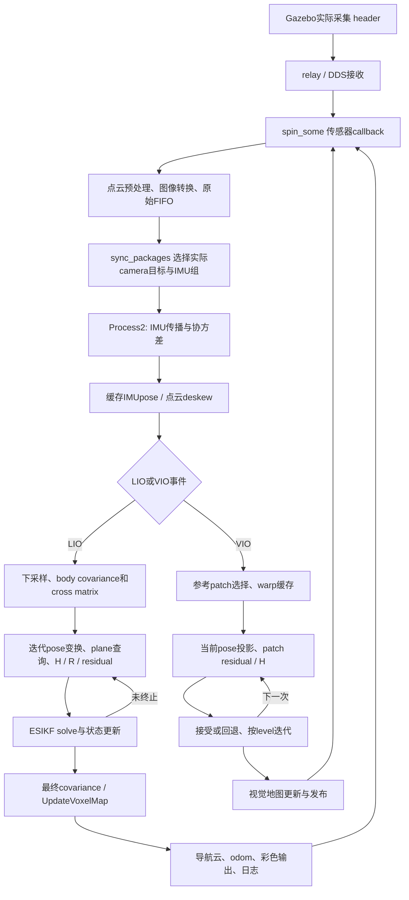
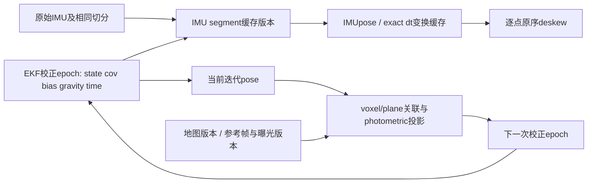

# FAST-LIVO2 计算图、复用和并行边界审计

本报告基于冻结 V11 及独立 V12 源码、已有真实时序记录和隔离 LIO fixture。未修改估计器数学、未停止训练、未运行实体机器人。本报告中的下一步候选尚未实现或通过，不能替代完整链验收。

## 已实际验证的最小并行优化

V11 `BuildResidualListOMP()` 每个点独立查询只读 voxel/plane，但 `vector<bool>` 用位存储，共享写必须互斥；原实现连独立的 `all_ptpl_list[i]` 赋值也进入同一锁。增加线程会增加锁等待，原 24,843 点 fixture 的 4/8 线程并未更快。

V12 只把标志槽改成 `vector<unsigned char>`，移除对应 mutex，保持每线程只写自己的 `useful_ptpl[i]` / `all_ptpl_list[i]` / `diagnostic_query_rows_[i]`。递归 `build_single_residual()` 的 map/plane 为只读，同一主线程在整个 StateEstimation 完成之后才 UpdateVoxelMap。OpenMP for 的隐式 barrier 之后仍按原 i 顺序串行 collect，没有并行 push_back 或浮点归约。宏只作用于 voxel_map.cpp，VIO 保持串行。

独立测试每个 component 至少 30 次，StateEstimation 预热 5 次、残差预热 8 次；1/2/4/8 team 均记录真实线程数和 CPU。V12 P4 的 StateEstimation 中位数 20.06 ms、残差 3.05 ms，V11 P4 为 41.31 / 7.77 ms。V12 P8 为 21.67 / 3.24 ms，未优于 P4。所有 V12 case 的 state/cov/完整有序残差与同核型 V11 逐字节一致。不同版本顺序执行，不能排除频率、缓存与背景负载影响；这不是完整地图回放，也不是整链 30 Hz 通过。详细数据见 `results.json` 和 `candidate_V12/results.json`。

同一 P 核组或 E 核组内位级相同；跨 P/E 有 37 个 state/cov double 不同，最大 2.22044e-18，完整残差仍位级相同。原因未证明，不能声称换核型绝对不改变数值。没有 unbound 对照，不能据此声称固定 affinity 改善整链。

## 当前串行计算图

源码：V11 `LIVMapper.cpp:769–805` 在 `spin_some()` 后处理一个同步事件，`processImu()` 再 `stateEstimationAndMapping()`。LiDAR callback 内执行 `p_pre->process()`，因此 callback CPU 工作和 DDS队列等待不能混为通信传输。

## 哪些已经缓存，哪些不能盲目跨状态复用

| 对象 | 当前行为与依赖 | 失效条件 / 低风险候选 |
|---|---|---|
| IMU propagation | `UndistortPcl()` 顺序递推 R、v、p、cov，保存每个 IMU 的 IMUpose，deskew 重用；并非每个点重积分所有IMU | 起始 EKF state/cov、bias、gravity、acc scale、输入IMU、时间段或切分边界变化必须失效；不能并行打散顺序递推 |
| 同时间戳点的 deskew | 每点计算相同 interval 的 `R_imu*Exp(w,dt)` 与 `T_ei`；type0预处理确实令 curvature=0 | 同一 IMUpose interval 且 dt 的位模式相同时，可复用 R_i/T_ei，保持原 P_compensate 运算括号；不要把它量化成近似时间。新pose/bias/time segment 后重算 |
| body covariance / cross matrix | StateEstimation 开始按点算一次，跨本次迭代已复用 | 新点云、噪声、extrinsic 后失效。注意开始循环把 z=0 改为0.001，而 solver 使用原 point_b；不能直接拿缓存 cross matrix替换 solver cross matrix而忽略此差异 |
| LIO world geometry / plane查询 | 每迭代 pose改变，重算world点、variance与map查询；同一 solve期间map只读 | pose改变可能改变voxel/plane匹配、概率与残差，不能沿用旧匹配称数值等价。缓存静态 body/extrinsic 几何可行，但不得把 `R*(extR*p+extT)` 改为合并矩阵后声称位级相同 |
| prior covariance inverse | `StateEstimation` 每迭代重复求 `state_.cov.inverse()`，`StatesGroup::operator+=`不改cov；cov只在终止后更新并break | 可作为下一独立候选：每次solve只缓存原表达式的prior inverse，保持求解表达式与原序；需验证所有接受/终止分支的位级结果。它不是已经验证的V12改动 |
| predicted point geometry | 本次 `state_propagat` 固定，某些点变换和body covariance可按原点索引缓存 | plane center/normal仍随匹配结果改变；原world cloud写入float，不能取消float舍入或变换括号 |
| visual warped reference patches | retrieval内已有warp_patch；normal=false分支warp_map按reference id复用并每帧清理，normal=true用当前homography | 当前帧pose/normal、reference选择、depth、intrinsics、image、level变化需重算；不能把跨帧warp固定 |
| inverse-compositional H cache | `precomputeReferencePatches()` 已缓存 H_sub_inv，每个 pyramid level重置，迭代重用 | 当前配置inverse_composition=false；切换true会改变算法分支和6/7维曝光处理，不属于“不改数学加速” |
| forward-compositional H | 当前pose投影、图像梯度、曝光每迭代重算 | 与pose/曝光/level相关部分必须更新；`vector<float> P = warp_patch[i]`只读deepcopy可单独改为const引用，这是更低风险复制优化候选 |
| VIO prior inverse | VIO在frame所有level后才更新cov，迭代`operator+=`不改cov | 可单独缓存本frame `(cov/img_point_cov).inverse()`，需所有rollback与曝光分支数值验收；不要跨frame复用 |
| UpdateVoxelMap | 修改unordered_map、octree、plane、临时点集合和阈值计数，受输入点原次序影响 | 不能与残差只读查询重叠使用同一mutable map；并行插入同voxel会改变阈值触发和plane拟合顺序 |
| 发布与日志 | 含point transform、projection/color、ROS message构造、序列化、共享内存/IPC、格式化和writer | immutable snapshot后可考虑异步输出；必须保留header/pose/array版本及实际发布账本，不减少导航cloud、odom或原算法RGB输入 |

## buffer容量复用的具体初始化风险

`StateEstimation()` 当前 `vector<pointWithVar>().swap(pv_list_)` 每帧强制释放，然后resize新构造；world cloud每迭代重新new，Hsub/Hsub_T_R_inv/R_inv/meas_vec也按当前约束数重新分配。这些确实可考虑保留capacity，收益取决于真实allocation占比；3×3 SO3乘法本身应按大量独立点批处理，不宜每个矩阵启动线程。

**不能只把swap替换成resize。** `pointWithVar`构造器把point_b/point_i/point_w、var_nostate/body_var/var/point_crossmat和normal全清零；每迭代只覆盖point_b、point_w、var、body_var，而normal只在成功plane匹配时赋值。`VIO generateVisualMapPoints()` 用`normal==0`跳过没有法向的点。跨帧保留旧normal会把本帧匹配失败的点伪装成成功，改变视觉地图。安全候选是保留capacity但每个新帧按原构造语义重置全部对象（例如原序clear后resize，在足够capacity时仍调用构造），保持同一帧迭代间normal原有持续语义。其他unused字段也不能未经消费者审计直接省初始化。

H/measurement可保留最大capacity，但当前effective row/column必须精确resize、零化和写全，不能把上帧多余行带入矩阵乘法。复用world cloud应按原点数/顺序写入，并保留double→float的舍入、intensity字段。残差collector可复用槽容量，但每调用flag必须全false、PointToPlane默认字段和diagnostic query零值仍需原语义。所有候选要在连续多帧、约束数增减、成功→失败→成功、零z点与visual-map更新分支验证，单帧终点一致不够。

## SO(3)/SE(3) 与类似预积分的优化

SO(3)/SE(3) 是计算的状态与变换，并不是所有矩阵运算可一次预积分后复用的通用加速开关。可复用的是输入和依赖版本未变的具体结果，例如相同 IMU interval/dt 的 Exp、固定 reference 的 inverse、固定 body点/extrinsic几何。pose/bias更新后旧结果往往失效；当前plane association和photometric projection也依赖新的pose。

当前 IMUpose 已把一个时间段的顺序传播结果保存下来供多个点使用。进一步把IMU区间做相对Delta并保存bias Jacobian，可避免后续重复遍历，但起始state/bias/gravity/时间切分不同会改变传播。仅一阶bias correction或重线性化策略属于估计结构变化，不能当作严格数值等价。当前 state还有曝光及19维cov，不能直接替换为泛用SE3 pose-only预积分并声称原数学未动。

另一个实际重复边界是 `imu_prop_callback()`：低频EKF更新后从 `latest_ekf_state/time` 重放未校正的prop_imu_buffer，之后仅增量推进最新IMU。现在executor串行保证校正锚点与buffer操作次序。改为高频预测独立线程时必须原子提供同一epoch的state/cov、bias、gravity和time；只锁buffer不足以保证`latest_ekf_state`等多字段一致。要比较原始IMU组、传播边界、偏置/协方差和输出，而不只是终点pose。

## 通信、计算与等待如何拆开

旧 `[sync_audit]` 的 LIO墙钟定义是kind10 Process2包装开始至kind13 StateEstimation结束，**不只是residual/solver，也不含后续map update与主要发布**。VIO至processFrame结束。20–40s实测 LIO均值23.504ms、VIO2.500ms、完整LIO→下一LIO循环33.671ms；约7.667ms差值包括MapUpdate、发布投影/转换、callback/preprocess、sync/等待、文件flush与调度。不能把这部分直接叫IPC，也不能把它全部叫map update。

真实采集callback/源stamp与开始消费间等待从9.20ms增长到233ms、9.287s和14.488s，证明排队后落。它并不证明网卡/共享内存传输用了这些秒：单线程不能及时spin、DDS缓存、应用FIFO和计算都可能贡献。rawgate持续新鲜而LIO消费慢于输入，是当前更直接的瓶颈证据。

旧owned_resources主要记录load、GPU/RAM和`ps %cpu`（且runner传的是owned父进程列表）。`ps %cpu`是进程存活期间平均值，不是阶段delta；launch父进程也不能代表fastlivo_mapping子进程。现有旧记录不足以精确拆出“通信占比”。整体20核空闲不代表单条串行critical path满足33.33ms预算。

V12新增kind300只读边界计时，记录wall、当前thread CPU、整个process CPU，17个边界如下。它是诊断观察，不提供估计器输入。

| ID | 边界 | 包含 / 嵌套 |
|---:|---|---|
| 0 | Process2 | 初始化或IMU传播+deskew；含1/2 |
| 1 | UndistortPcl | IMU传播和去畸变；含2 |
| 2 | deskew points | 每点变换 |
| 3 | residual query | BuildResidualListOMP；含并行team等待 |
| 4 | LIO StateEstimation | 本次缓存构造、迭代geometry/query/H/solve与其诊断；含3 |
| 5 | UpdateVoxelMap | 地图修改与地图诊断 |
| 6 | VIO processFrame | clone/gray、retrieval、solver、visual-map生成/更新 |
| 7 | publications | 已包裹函数的projection/color/转换/serialize与publish调用；不代表纯DDS通信 |
| 8 | spin_some | callbacks及定时器，含9/10/11/12；可能含IMU-propagation发布 |
| 9 | LiDAR callback | raw诊断、preprocess、队列复制；含12 |
| 10 | IMU callback | copy/time offset/队列/诊断 |
| 11 | image callback | image转换/clone/队列/诊断 |
| 12 | preprocess | PointCloud2/Livox解码过滤 |
| 13 | sync_packages | 选择buffer、切分消息组 |
| 14 | handleLIO全部 | 下采样、4/5/16、odom/cloud及日志；含3/7 |
| 15 | handleVIO全部 | 6、图像/彩色输出及日志 |
| 16 | BuildVoxelMap | 首次图初始化 |

这些是嵌套inclusive时间，不能把17项相加。kind300约每1秒在某个Scope完成后归集并清零；外层Scope可能跨flush边界，最后不足1秒尾窗未必有记录。因此单窗`parent-child`不能自动当精确exclusive成本，长稳态窗口应核对calls与首尾裁切。0之外processImu包装的kind10/11复制、gravity alignment也没有独立Scope，整个循环尚无单一排他成本表。

`thread CPU`接近wall支持当前线程算力占用；wall大而thread CPU小可能是调度、I/O、锁或OpenMP worker等待。`process CPU`包含OpenMP与异步logger CPU，甚至可大于wall，不能用wall-process差值称通信。要进一步分开：用同payload/source的callback entry→group consume、phase CPU/wall，加入publisher构造前/实际publish前后/receiver entry，以及线程调度/off-CPU或受控syscall采样。ROS publish函数本身包含序列化/队列；不能仅凭publish wall称纯传输。

## 下一优化顺序与验收要求

1. 已完成 V12 uint8独立collector并通过同核型有限数值对照；由真实210s/完整路线观察kind300和源新鲜度决定整链收益。
2. 根据真实stage占比，再独立验证同时间戳deskew缓存、prior inverse缓存、patch const-reference与容量复用；逐项保留原运算括号、精度、索引顺序，比较residual/H/state/cov/iteration/接受回退/输出源。
3. 若数据到达处理仍堵塞，设计独立接收/预处理流水线：固定原FIFO输入和IMU组，immutable消息所有权，单估计器state writer。仅加MultiThreadedExecutor会改变同期覆盖、匹配消息与更新次序，不能自动保证数值等价。
4. MapUpdate若占比显著，可按独立voxel分组并保留每voxel原点次序，仍需审计全局plane-id/diag计数、unordered_map插入和发布顺序。读写重叠须版本快照/双缓冲，而不是同时读写现map。
5. VIO已有MP分支以float `error`归约决定接受/回退；如要并行，先按独立patch写误差、原索引串行sum再回放原控制分支。没有位级证明前不启全target MP。

源码引用均相对 `navigation/lidar_sampling_v11/slam_ws/src/fast_livo2_core/`：`src/IMU_Processing.cpp:284–615`、`src/voxel_map.cpp:397–640,777–995`、`src/vio.cpp:376–936,1498–1966`、`src/LIVMapper.cpp:422–895`、`include/fast_livo2_core/core/common_lib.h:129–225`。V12新增timing与collector位于同结构的 `lidar_sampling_v12`。既有同步与资源证据见 `../sync_audit/README.md` 和 `evidence.json`，不改旧归档。
