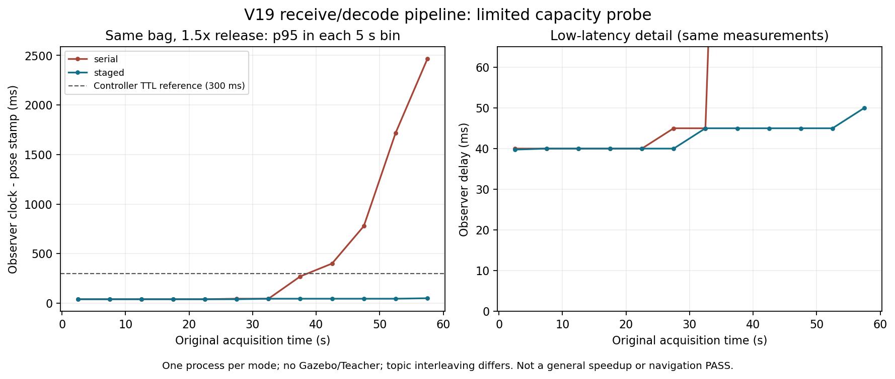
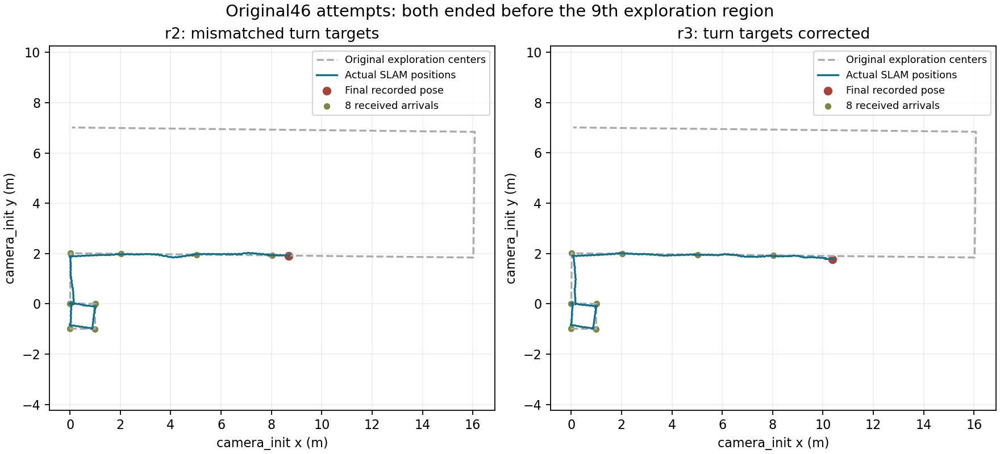

# V19 流水线优化与原46区域任务实测

2026-10-06。本轮已实现并实测多线程流水线；原完整46区域任务重跑仍失败，最终为 **8/46**。这与历史V12/V18指定静态32区域单次通过是不同任务，不能相互替代。全部实验仅仿真，未修改训练或已通过的 camera_mode。

## 实现与性能边界

接收线程快速收取消息引用，点云与图像分别解码，经有界队列、全程 reservation、顺序 ready 提交给唯一估计 owner。全生命周期容量为512项/64 MiB，不静默覆盖；DDS和已提交后的SLAM内部缓冲不包含在该上限内。正常停止先封闭接收，再排空解码及估计，最后关闭ROS；紧急context无效时保留失败。

LIO逐点残差与Jacobian使用4线程，VIO patch使用此前实测较合适的1线程。IMU传播→LIO→VIO→状态/地图更新仍共享状态、按序执行。因而当前流水线的理想周期下界是 `max(接收, 点云解码, 图像解码, owner整段估计)`，不能写成 `max(IMU,LIO,VIO)`，也未证明已经达到该理想下界。

56项生产包语义、8项实际ROS生命周期、100个新进程有限数值/浮点环境/加载检查通过；根预检94项通过。另52项控制回归为51通过、1项旧V9整文件身份门失败：新版任务与朝向参考源码已显式改变，旧断言和失败日志保留，不将其改写为通过。有限数学测试不等于整条前端历史输入逐帧位姿相等。

| 同一新60秒传感器包的离线对照 | 串行 | 流水线 | 解释 |
|---|---:|---:|---|
| 1x，ABBA共4轮 | 1709 pose/轮 | 1709 pose/轮 | 完整输入，约30 Hz供给下没有明显时效改善 |
| 1.5x，单次容量对照，位姿滞后p95 | 1891 ms | 45 ms | 有限输入/单对照，不能外推普遍加速倍数 |
| 1.5x，位姿滞后max | 2535 ms | 50 ms | 两者均1709 pose；流水线减少积压 |
| 1.5x，墙钟位姿输出 | 42.87 Hz | 45.11 Hz | 同包加速回放，非真实机器人速度 |

同步切片也因消息可用时刻改变。串行1.5x存在IMU覆盖不足窗口，故不能把所有求解耗时差归因于纯算子加速。详细[性能报告](performance/REPORT.md)、[容量对照](performance/CAPACITY_1P5X_REPORT.md)和[同步/输出审计](performance/POSE_SYNC_OUTPUT_AUDIT.md)保留限制及全部6轮。



## 实际Gazebo结果

导航位置、速度、朝向、SCAN路线和区域到达使用实际SLAM/IMU/点云。Actor仍为232维仿真特权输入＋15维已知命令/上一动作；本轮没有完成全感知Actor替换。Teacher始终CPU单线程50 Hz、唯一关节执行器；300 ms保护保持，不以action=0停车。

| run后缀 | 实际任务及结果 | 流水线/故障 |
|---|---|---|
| `9eaf` | 60秒限定前缀，8/32区域，Actor无fault或机身接触 | 31,858条全部正常提交；不是完整导航通过 |
| `5a18` | 原46任务首次启动失败，0 Actor样本 | ROS Node只读属性命名冲突；紧急退出记录保留 |
| `4fc5` | 原46第二次，8/46，目标9超时 | 146,251条全部正常提交；外门锁定旧朝向、内环追踪新路径，平移无法释放 |
| `9779` | 修订03第三次，**8/46，失败** | 139,102条全部正常提交；旧参考冲突解除，SCAN起始小段切线仍反复跳变 |

原46合同为探索18区＋返回14区＋当次RGB地图保存＋导航14区，保留原动态障碍、区域几何、0.4 s dwell和90 s单目标期限。r3只到探索前8区；返航、地图保存、后14区、多层地形切换、动态停车恢复及最终5 s停车均未执行，不记通过。三层连接为坡道，不是真实楼梯。

r3旧故障修复已实测：938次align更新与外门锁定参考完全一致，2549次其它参考更新也一致。最终直接失败链是：近零起始速度产生微小路径段→其切线方向大跳→原0.2 rad朝向门反复复位→90 s内未到第9区。独立读取104条新路径，冻结投影计算与实际记录逐条一致。例如最近段仅67.17微米，局部切线2.25080 rad，而整条路径方向0.17443 rad。90秒内记录的pre_turn/align/settle约占44.50/13.11/5.355秒，drive约26.98秒。

第9区133.450 s激活；首次失败发布223.475 s，elapsed90.025 s；首导航状态采样223.615 s。退出后的IMU超时不是首失败原因。为何SCAN持续产生该起始段、估计噪声与Teacher微动各占多少影响尚未独立隔离。下一项应检查有效弧长切线、近零速度的规划起始条件及新旧路径参考连续性，并以原保护门复测；不能简单加PID频率或放宽转向门后称通过。

运行期SLAM/点云/IMU来源max age为140/136/91 ms，均低于300 ms；无obstacle_hold或tilt_hold。11534帧50 Hz native快照无fault或机身接触，但完整200 Hz物理门、全部PI与SCAN点云几何重放仍未验证。独立任务验收为9项通过、3项失败、8项未验证；不据采样快照宣称完整运动验收通过。

[详细失败因果与曲线](evaluation/V19_9779_FAILURE_REPORT.md)、[独立任务收据](evaluation/V19_9779_INDEPENDENT_MISSION_EVALUATION.json)、[104次切线投影审计](evaluation/V19_9779_HEADING_RESET_PROJECTION_AUDIT.json)。



## 仿真时间与墙钟时间

| 位姿实际采集窗口 | SLAM源时间频率 | 墙钟输出频率 | 仿真/墙钟比例 |
|---|---:|---:|---:|
| 60秒前缀 | 30.305 Hz | 29.714 Hz | 0.980 |
| r3原46尝试，6879 pose | 30.303 Hz | 22.338 Hz | 0.737 |

这仅是首末pose receipt之间的窗口，不是启动至退出整轮RTF。较长任务尚未持续满实时；不能据仿真时间30 Hz宣称墙钟30 Hz。r3 LiDAR解码p50/p95为0.446/0.604 ms、RGB为0.167/0.259 ms；接收至提交含计算与排队，不能当纯通信耗时。顶层进程CPU采样不涵盖全部SLAM子进程，尚不能唯一归责通信、GPU或某一计算模块。见[时钟定义](performance/ACTUAL_CLOCK_DOMAINS.json)和[r3时序审计](performance/ACTUAL_46_R3_TIMING_AUDIT.json)。

## 版本与复现

| 冻结对象 | SHA256 |
|---|---|
| Teacher model_1000.pt | `bfe7fbbffe85fdb60cac590f1a6080a10609011ab6a538a078381261e98fbd34` |
| V19实际加载C++库 | `f06e68d0dcbcab9f840077c372d0cda2e128f9935c4fe968987784e2124e00d8` |
| 修订03本机预检 | `50285356c2dd3e33d971c31c05089e04758464db2b84acfa40ef794b29efb79a` |
| r3独立任务验收 | `259e84625740bd74a18f55803dceca1cf0603ec27e76ecd438f1cd40e35b582b` |

[候选源码与运行命令](../../navigation/pipeline_v19/README.md)。本机在项目根目录：

```bash
python3 -B multifloor_demo/teacher_mode/navigation/pipeline_v19/run.py --profile pipeline_staged_60 --label v19_prefix --domain 88 --prepare-only
python3 -B multifloor_demo/teacher_mode/navigation/pipeline_v19/run.py --profile pipeline_staged_original46 --label v19_original46 --domain 89
python3 -B multifloor_demo/teacher_mode/scripts/serve.py --port 8768
```

命令实际运行会新建run；先确认本任务仿真/执行器未被其它进程占用。新机器不能继承本机路径绑定的gate：远程仓库仅提供V19源码与构建入口，V19便携运行仍明确阻断，须补做该机数值/队列预检。历史V18便携构建与prepare-only不授权V19。

[浏览器实际画面、路线和独立失败结果](http://127.0.0.1:8768/?run=20261006_024447_closed_loop_cascade_clock_hold_v19_original46_r3_heading_9779)。这是已结束运行的归档，非当前实时运动。旧351.52 GiB raw已按授权删除；本轮新失败日志和新传感器包仍保留本机，Git仅保存源码及精简报告/图/哈希，不上传大日志或权重。旧PACKAGE_MANIFEST不改写，新V19另列精简清单。

## 分层结论

- 接口：已有验过的247/12映射、CPU推理与唯一执行器继续使用；V19有限代码及流水线生命周期检查通过。
- 运动控制：历史有限运动和V12/V18静态32区域结论保留；V19本轮有真实运动，但完整物理验收及原46任务未通过。
- Sim2Sim：严格整体仍未通过；新控制器没有匹配Isaac闭环对照。
- 导航集成：真实SLAM/SCAN已接入；本次原46任务失败8/46，未完成项明确未验证。
- 真机部署：未验证，本任务未操作实体机器人。

## 精简导出边界

performance/内冻结报告中的“下一步短程/46”是当时计划，本报告给出后来已完成的9eaf/r1/r2/r3结果。原工作区的bag、逐消息CSV/JSONL、shadow位姿及二进制不随Git导出，详见[原607文件导出边界](performance/EXPORT_SCOPE.md)。旧COMPACT_EXPORT_MANIFEST仅覆盖其当时607份文件；本轮新增报告、截图和小型run元数据由本目录PACKAGE_MANIFEST_V19_COMPACT.json另行覆盖。精简证据不能替代完整原输入重验。
