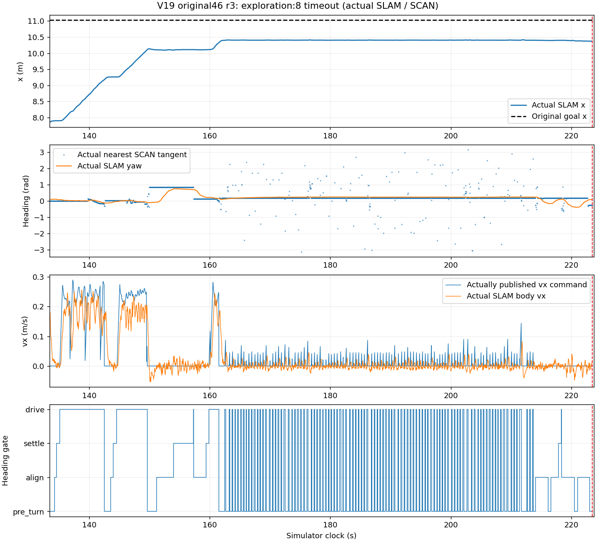

# 原46区域 V19 r3 独立失败报告

原46任务未通过。本轮原点初始化和8个原探索区域的真实SLAM到达证据通过，但第9区 `exploration:8` 在原90s期限内未到达。返航14区、当次RGB保存、F1→F3导航14区、3次地形切换、动态障碍停车恢复和最终5s停车均未执行，不记通过。本次只做仿真。

朝向参考 revision03 已实测一致：938次 align 转向更新使用外部门真实锁定朝向，2549次其它有效参考更新也一致，最大参考差0。旧“外门锁旧路径、内环追新路径”的故障已解除，原增益、0.2rad行走朝向门、0.1rad转向完成门、300ms时效和90s期限均未改变。

失败窗口和直接机制：

- 目标在133.450s激活。首个已失败的实际零速度发布为223.475s（elapsed90.025s）；首个导航状态采样为223.615s。原控制源码在保护检查前执行该期限分支，随后 wrapper 把消息覆写成“等待停车”，因此不能把这句状态文字当根因。
- 第9区的104次 `drive→pre_turn` 全部伴随新SCAN路径，独立读取104个原NPZ、样本索引和哈希，并调用冻结core的纯局部投影后，切线与运行记录完全一致；全部超出原0.2rad门。未调用Controller.update，也未宣称完整PI重放通过。
- 最近起始小段方向与整条路线差别很大：163.340s path390最近段只有67.17微米，切线2.25080rad，但起点到终点方向0.17443rad；其规划起始 used_velocity 约[-0.000980,0.000570,0.001260]m/s。162.665s path372最近0.393mm段切线−0.63840rad，整条路径方向0.17477rad。
- 90s内PID记录覆盖的阶段约 pre_turn44.50s、align13.11s、settle5.355s、drive26.98s。约x10.4m以后频繁短行走脉冲被重新停车打断。独立事实支持“接近停稳的微小速度与样条起始局部方向，经单位化成为大朝向变化，并触发门复位”这一机制；为什么SCAN持续产生这种起始段、速度估计与Teacher动作各占多少影响，还未单独隔离，不把GPU或策略作为已证明的唯一原因。

来源、安全与流水线：

- 原8区域的身份、顺序、0.4s连续dwell和内控制区域均通过；实际SLAM最大dwell观测间隔35.000001ms。
- 第9区运行期max age为SLAM140ms、点云136ms、IMU91ms，均小于300ms；未出现obstacle_hold/tilt_hold。退出后的IMU超时单列为清理观测，不是首运行期失败。
- 11534帧原50Hz native快照：fault0、机身接触0、最大roll0.03555rad/pitch0.10441rad、最大关节速度13.9383rad/s/力矩15.6797Nm，最低机身间隙0.25811m。严格200Hz执行器trace和完整发布/PI/所有SCAN几何重放仍未验证。
- 冻结Teacher SHA、CPU单线程、唯一TeacherActuator、实际加载f06 SLAM库、181个归档源和真实SLAM来源检查通过。Actor仍用232维特权输入；导航未使用Gazebo真值。
- 流水线139102 accepted=delivered=committed，0canceled、0capacity reject、0closed reject，实际ROS context有效时完成排空。完整46任务因此失败，不能由流水线排空通过改称导航通过。

全运行量化事实：实际SLAM header30.302897Hz、独立数学有效更新3487次/212.950s≈16.37004Hz（行走/转向/停车门导致未每帧更新，不能当作输入帧率）；路线cross max0.092499m/RMS0.016445m，速度PI误差MAE[x,y,w]=[0.081256,0.029181,0.125212]。这些不是完整路线通过指标。源header频率和wall频率必须分开：同6879pose窗口wall22.338302Hz、仿真/墙钟比例0.737167，见 [ACTUAL_CLOCK_DOMAINS.json](../performance/ACTUAL_CLOCK_DOMAINS.json)；不能据此独断算法或系统通信耗时。

证据：

- [独立任务验收](V19_9779_INDEPENDENT_MISSION_EVALUATION.json)：总体FAILED，未执行项和未完整重放项保持UNVERIFIED。
- [8个原区域收据](V19_9779_PARTIAL_ORIGINAL_REGION_RECEIPTS.json)
- [首失败时钟/源码因果窗口](V19_9779_FIRST_FAILURE_CAUSAL_WINDOW.json)
- [104次切线与门复位审计](V19_9779_HEADING_RESET_PROJECTION_AUDIT.json)
- [流式原记录事实](V19_9779_BOUNDED_RUN_FACTS.json)
- [原目标窗口与选定原行字节引用](V19_9779_FAILED_REGION_OBSERVATION.json)

原始运行目录保持只读，所有新增报告与收据只写 evaluation/。图只用于观察，不替代完整安全、来源或数学验收。本轮没有重新训练、操作真机或修改通过的camera Demo。
